# Fastflow Architecture

This document explains the internal architecture of Fastflow, a Python library that wraps AntV X6 for FastHTML.

## Overview

Fastflow bridges the gap between Python/FastHTML on the server and X6 JavaScript in the browser, using HTMX for seamless communication. It uses **fastcore idioms** including type dispatch, two-way callbacks, `store_attr`, and `@patch` for extensibility.

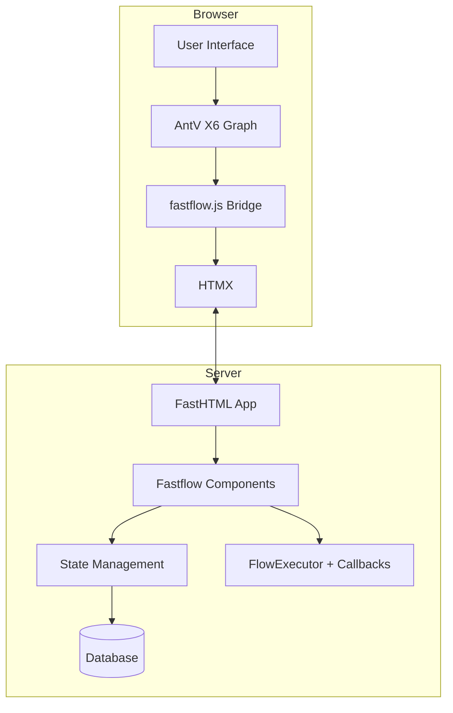

## Layered API Architecture

Fastflow provides a **layered API** inspired by fastai, allowing users to work at different levels of abstraction:

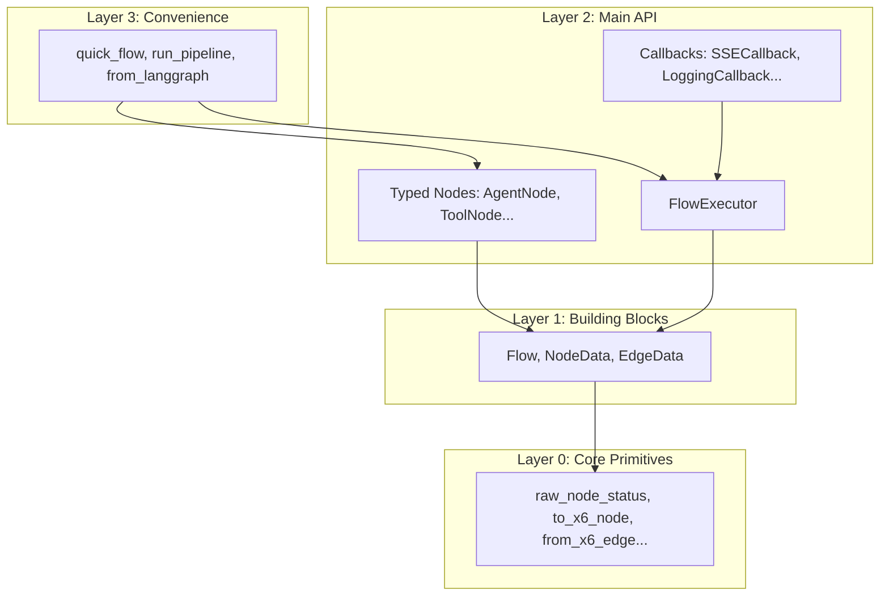

### Layer 0: Core Primitives (`core.py`)
Raw building blocks for advanced users:
- **SSE Helpers**: `raw_node_status()`, `raw_edge_status()`, `raw_complete()`, `raw_error()`
- **X6 Converters**: `to_x6_node()`, `to_x6_edge()`, `from_x6_node()`, `from_x6_edge()`

### Layer 1: State Management (`state.py`)
Data classes with fastcore ergonomics:
- `NodeData`, `EdgeData`, `Flow` using `store_attr()`
- Extensible via `@patch` without subclassing

### Layer 2: Main API (`types.py`, `callbacks.py`, `execution.py`)
The primary API for most users:
- **Typed Nodes**: `StartNode`, `AgentNode`, `ToolNode`, etc.
- **Type Dispatch**: `render()`, `execute()`, `validate()`, `can_connect()`
- **Callbacks**: `FlowCallback`, `SSECallback`, `LoggingCallback`
- **Executor**: `FlowExecutor` with callback integration

### Layer 3: Convenience (`api.py`)
Quick-start functions for common patterns:
- `quick_flow()` - Create executor from list of dicts
- `run_pipeline()` - Create linear pipeline from functions
- `flow_from_steps()` - Create Flow with auto-layout

## Component Layers

### 1. Python Components (`components.py`)

The Python layer provides FastHTML-style FT components:

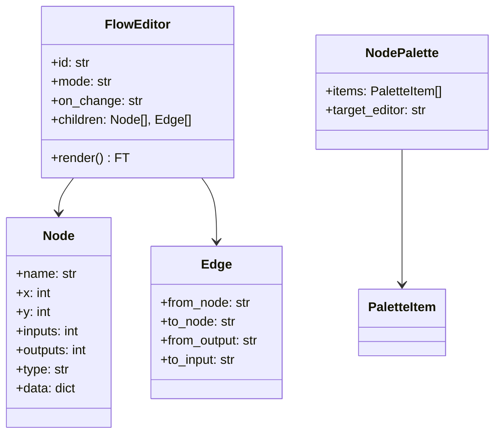

### 2. State Management (`state.py`)

Python dataclasses that mirror X6's data structures:

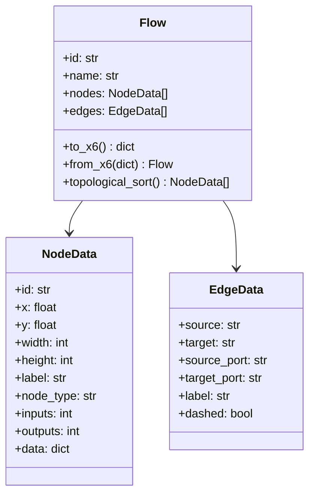

### 3. JavaScript Bridge (`fastflow.js`)

The bridge connects X6 events to HTMX:

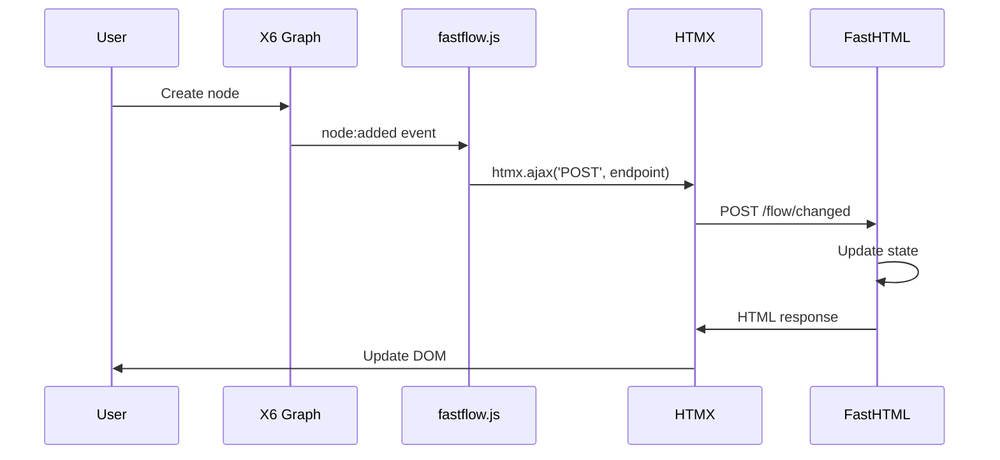

## Data Flow

### Initialization

When `FlowEditor` renders:

1. Python generates HTML with configuration as JSON
2. JavaScript initializes X6 Graph with the config
3. Initial nodes/edges are programmatically added with ports
4. Event listeners are attached for HTMX integration

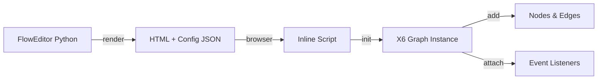

### User Interactions

When a user modifies the flow:

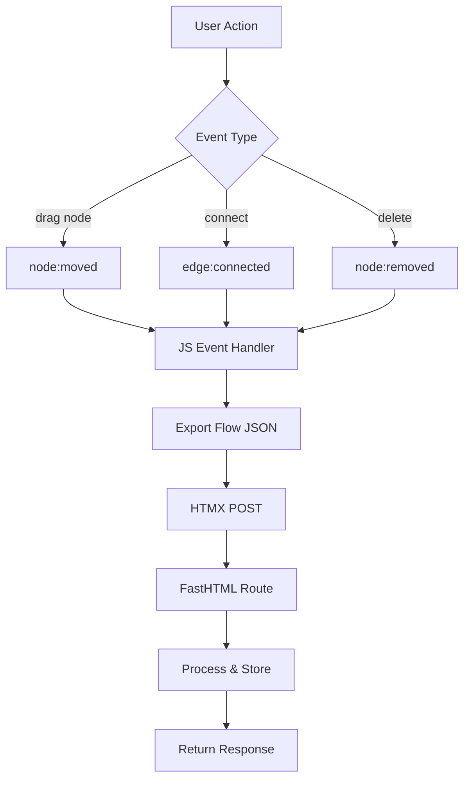

### Drag-and-Drop from Palette

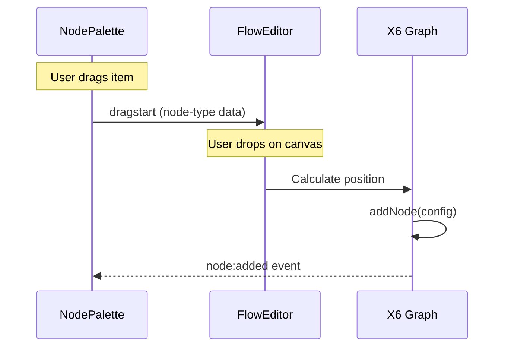

## Type Dispatch System

Fastflow uses **type dispatch** (via `plum-dispatch`) for node operations, similar to Julia's multiple dispatch:

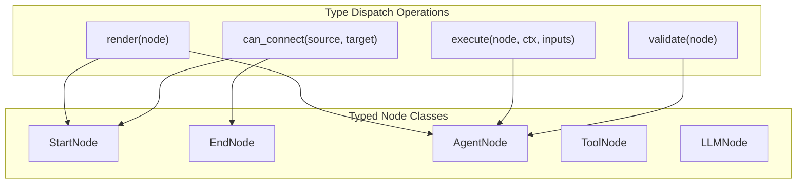

### How It Works

```python
from dataclasses import dataclass
from fastflow.types import FlowNode, render, execute, can_connect

# Define a typed node
@dataclass
class AgentNode(FlowNode):
    node_type: str = "agent"
    model: str = "gpt-4"
    temperature: float = 0.7

# Register type-dispatched operations
@render.register
def _(node: AgentNode):
    return Div(f"🤖 {node.model}", cls="agent-node")

@execute.register
async def _(node: AgentNode, context: dict, inputs: dict):
    # Custom execution logic
    return await call_llm(node.model, inputs)

@can_connect.register
def _(source: AgentNode, target: EndNode) -> tuple[bool, str]:
    return True, ""
```

### Benefits Over Registry Pattern

| Old Registry | New Type Dispatch |
|--------------|-------------------|
| String-based lookup | Type-safe dispatch |
| Single render function | Multiple operations per type |
| Manual registration | Automatic via decorators |
| Hard to extend | Easy extension via `@register` |

### Type Dispatch Integration for UI Components

Typed nodes from Layer 2 can be seamlessly converted to UI components:

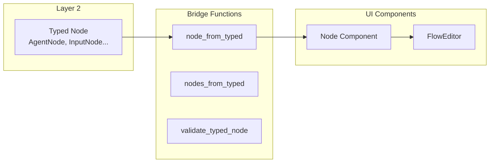

```python
from fastflow.types import AgentNode, InputNode, FilterNode
from fastflow import node_from_typed, nodes_from_typed, FlowEditor, Edge

# Create typed nodes with execution logic
agent = AgentNode(id="agent1", x=200, y=100, label="My Agent", model="gpt-4")
input_node = InputNode(id="input1", x=50, y=100, label="Load Data")
filter_node = FilterNode(id="filter1", x=350, y=100, label="Filter")

# Convert to UI nodes - styles auto-inferred from type
FlowEditor(
    node_from_typed(agent),
    node_from_typed(input_node),
    node_from_typed(filter_node),
    Edge(source="input1", target="agent1"),
    Edge(source="agent1", target="filter1"),
    id="my-flow"
)

# Or convert multiple at once
nodes = nodes_from_typed([agent, input_node, filter_node])
```

This bridges the gap between:
- **Layer 2 typed nodes** - For execution logic, validation, type-safe operations
- **UI components** - For browser rendering with X6

## Two-Way Callback System

The callback system is inspired by **fastai's Learner callbacks**, allowing you to read AND modify execution state:

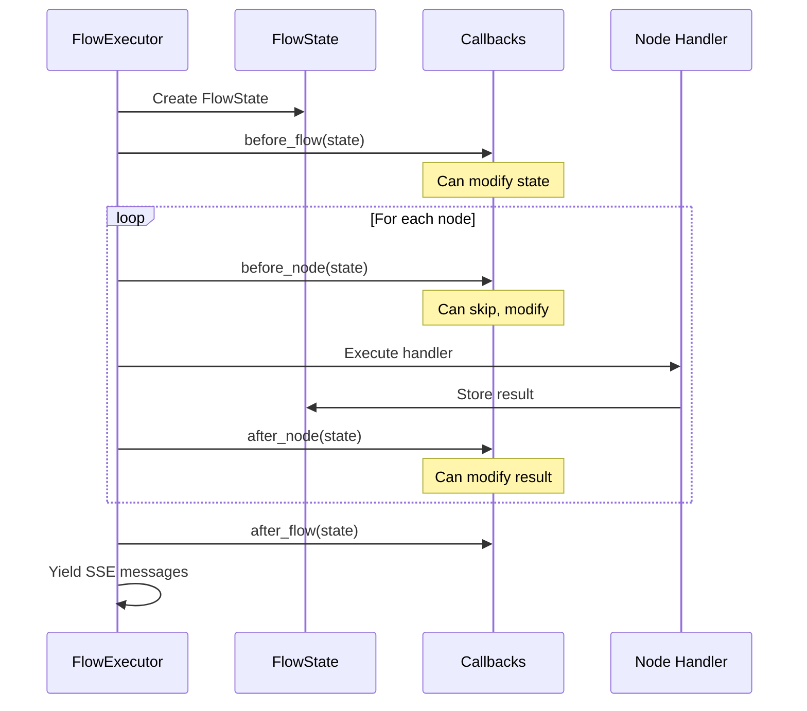

### FlowState

The mutable state object passed to all callbacks:

```python
@dataclass
class FlowState:
    graph_id: str
    steps: list[ExecutionStep]
    results: dict[str, Any] = field(default_factory=dict)
    errors: dict[str, Exception] = field(default_factory=dict)
    current_step: Optional[ExecutionStep] = None
    context: dict = field(default_factory=dict)
    cancelled: bool = False
    # ... timing, progress fields
```

### Control Flow Exceptions

Callbacks can control execution flow:

```python
class MyCallback(FlowCallback):
    def before_node(self, state: FlowState):
        if state.current_step.node_id == "skip-me":
            raise SkipNodeException("Skipping this node")

        if too_many_errors(state):
            raise CancelFlowException("Too many errors")

    def on_error(self, state: FlowState, exc: Exception):
        if is_transient(exc):
            raise RetryNodeException("Retrying...")
```

### Built-in Callbacks

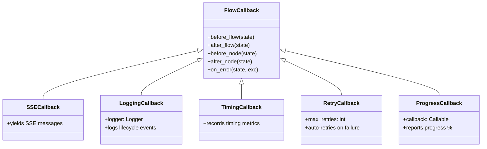

### Using Callbacks

```python
from fastflow import FlowExecutor, ExecutionStep
from fastflow.callbacks import SSECallback, LoggingCallback, TimingCallback

executor = FlowExecutor(
    graph_id="my-flow",
    steps=[
        ExecutionStep("step1", handler=my_handler),
        ExecutionStep("step2", depends_on=["step1"]),
    ],
    callbacks=[
        SSECallback(),        # Browser updates via SSE
        LoggingCallback(),    # Structured logging
        TimingCallback(),     # Performance metrics
    ]
)

async for msg in executor.run(context={"key": "value"}):
    yield msg  # SSE messages for browser
```

## Serialization Format

X6 uses a simple nodes/edges JSON structure:

```json
{
  "nodes": [
    {
      "id": "start",
      "x": 100,
      "y": 50,
      "width": 120,
      "height": 40,
      "data": {
        "label": "__start__",
        "nodeType": "start",
        "inputs": 0,
        "outputs": 1
      }
    },
    {
      "id": "agent",
      "x": 100,
      "y": 180,
      "width": 160,
      "height": 60,
      "data": {
        "label": "agent",
        "nodeType": "agent",
        "inputs": 1,
        "outputs": 1
      }
    }
  ],
  "edges": [
    {
      "source": "start",
      "target": "agent",
      "sourcePort": "out_0",
      "targetPort": "in_0",
      "label": "next"
    }
  ]
}
```

The `Flow` class converts between this format and Python-friendly dataclasses.

## Event Handling

### Available Events

| Event | Trigger | Data |
|-------|---------|------|
| `node:added` | Node added | node config |
| `node:removed` | Node deleted | node id |
| `node:moved` | Node dragged | node, x, y |
| `cell:selected` | Cell clicked | cell |
| `edge:connected` | Nodes connected | edge config |
| `edge:removed` | Connection deleted | edge |

### HTMX Integration

Events trigger HTMX POST requests:

```javascript
htmx.ajax('POST', endpoint, {
    values: {
        event: 'node:added',
        data: JSON.stringify(eventData),
        flow: JSON.stringify(graph.exportFlow())
    },
    target: '#status',
    swap: 'innerHTML'
});
```

## File Structure

```
src/fastflow/
├── __init__.py       # Public exports (layered)
├── core.py           # Layer 0: Raw SSE/X6 primitives
├── state.py          # Layer 1: NodeData, EdgeData, Flow (with store_attr/@patch)
├── types.py          # Layer 2: Typed nodes + type dispatch
├── callbacks.py      # Layer 2: FlowCallback system
├── execution.py      # Layer 2: FlowExecutor with callbacks
├── api.py            # Layer 3: Convenience functions
├── components.py     # FT components for browser
├── headers.py        # JS/CSS headers
├── js/
│   └── fastflow.js   # JS bridge utilities
└── css/
    └── fastflow.css  # Default styles
```

## Extension Points

### Custom Typed Nodes (Recommended)

Create new node types using dataclasses and type dispatch:

```python
from dataclasses import dataclass
from fastflow.types import FlowNode, render, execute, validate, register_node_type

@dataclass
class CustomNode(FlowNode):
    node_type: str = "custom"
    my_field: str = "default"

# Register for string-based lookup
register_node_type("custom", CustomNode)

# Add type-dispatched operations
@render.register
def _(node: CustomNode):
    return Div(f"Custom: {node.my_field}", cls="custom-node")

@execute.register
async def _(node: CustomNode, context: dict, inputs: dict):
    return {"result": process(node.my_field, inputs)}

@validate.register
def _(node: CustomNode) -> list[str]:
    errors = []
    if not node.my_field:
        errors.append("my_field is required")
    return errors
```

### Extend Existing Classes with @patch

Add methods without subclassing:

```python
from fastcore.basics import patch
from fastflow import Flow, NodeData

@patch
def to_mermaid(self: Flow) -> str:
    """Convert flow to Mermaid diagram."""
    lines = ["graph LR"]
    for edge in self.edges:
        lines.append(f"    {edge.source} --> {edge.target}")
    return "\n".join(lines)

@patch
def is_start(self: NodeData) -> bool:
    return self.node_type == "start"

# Now you can use:
flow.to_mermaid()
node.is_start()
```

### Custom Callbacks

Create callbacks to hook into execution:

```python
from fastflow.callbacks import FlowCallback, FlowState

class MetricsCallback(FlowCallback):
    def __init__(self):
        self.metrics = {}

    def before_flow(self, state: FlowState):
        self.metrics["start_time"] = time.time()

    def after_node(self, state: FlowState):
        node_id = state.current_step.node_id
        self.metrics[f"{node_id}_completed"] = time.time()

    def after_flow(self, state: FlowState):
        self.metrics["total_time"] = time.time() - self.metrics["start_time"]
        save_metrics(self.metrics)
```

### Custom Styling

Override CSS variables or classes in your app:

```css
.node-container.custom-node .node-title {
    background: #your-color;
}
```

### Custom Event Handlers

Add server-side handlers for specific events:

```python
@rt("/flow/node-selected")
def post(event: str, data: str, flow: str):
    # Handle node selection
    return NodeConfigPanel(...)
```

## Resources

- [AntV X6 Documentation](https://x6.antv.antgroup.com/en)
- [AntV X6 GitHub](https://github.com/antvis/X6)
- [FastHTML Documentation](https://www.fastht.ml/docs)
- [HTMX Documentation](https://htmx.org/docs/)
