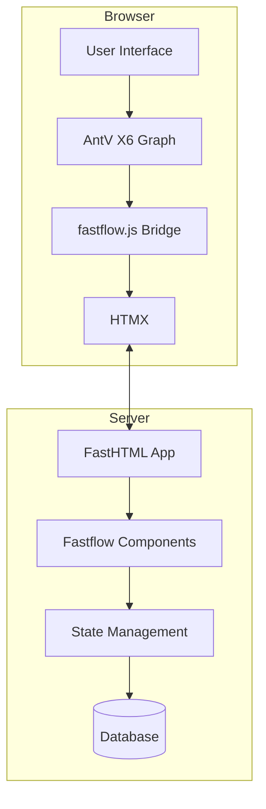
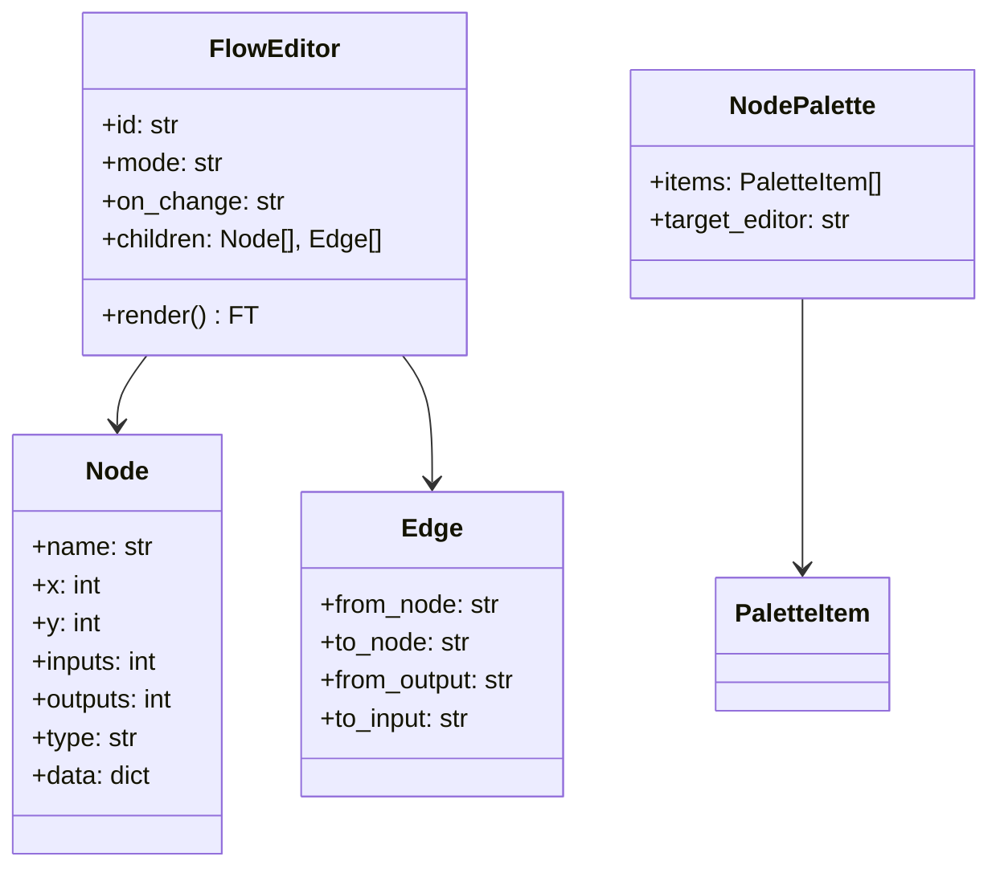
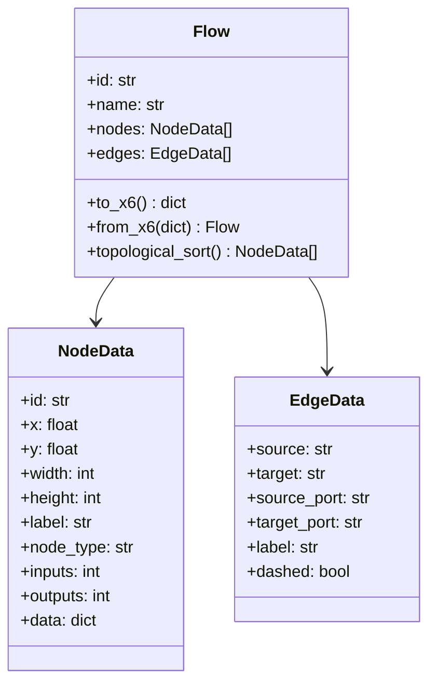
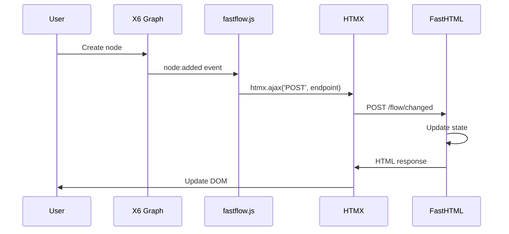
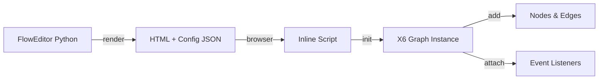
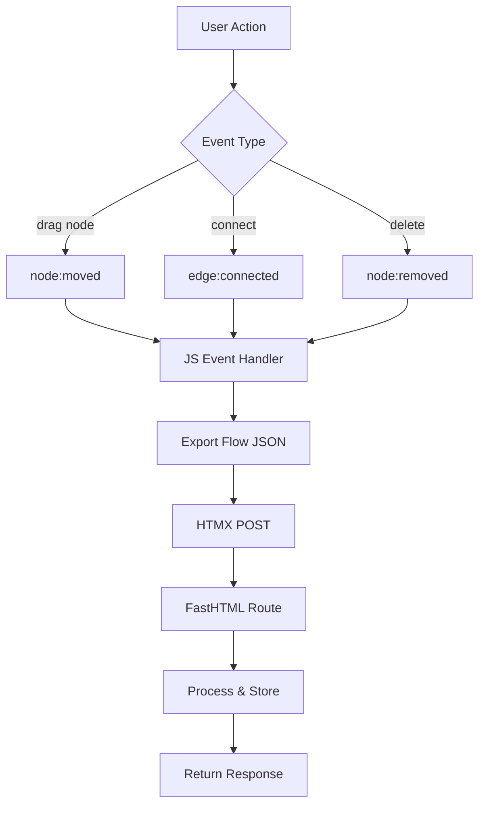
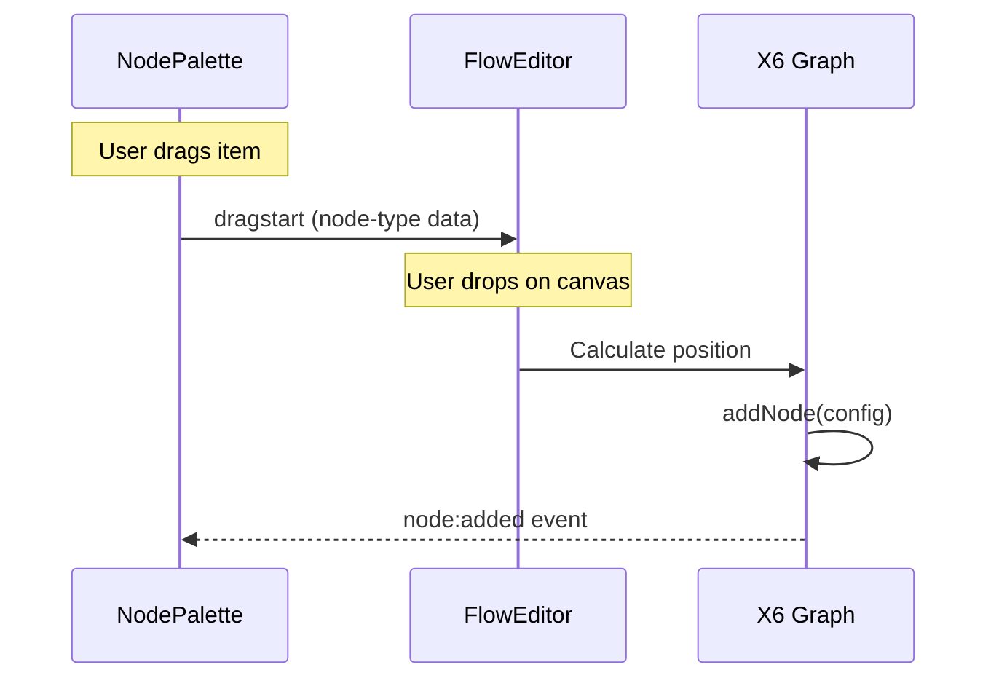

# Fastflow Architecture

This document explains the internal architecture of Fastflow, a Python library that wraps AntV X6 for FastHTML.

## Overview

Fastflow bridges the gap between Python/FastHTML on the server and X6 JavaScript in the browser, using HTMX for seamless communication.



## Component Layers

### 1. Python Components (`components.py`)

The Python layer provides FastHTML-style FT components:



### 2. State Management (`state.py`)

Python dataclasses that mirror X6's data structures:



### 3. JavaScript Bridge (`fastflow.js`)

The bridge connects X6 events to HTMX:



## Data Flow

### Initialization

When `FlowEditor` renders:

1. Python generates HTML with configuration as JSON
2. JavaScript initializes X6 Graph with the config
3. Initial nodes/edges are programmatically added with ports
4. Event listeners are attached for HTMX integration



### User Interactions

When a user modifies the flow:



### Drag-and-Drop from Palette



## Node Type System

The `@NodeType` decorator registers custom node types:

```mermaid
flowchart LR
    A[@NodeType decorator] --> B[Register in _node_type_registry]
    B --> C[Store: name, inputs, outputs, func]

    D[Node component] -->|type="llm"| E[Lookup registry]
    E --> F[Get NodeTypeInfo]
    F --> G[Call func with data]
    G --> H[FT component]
    H --> I[to_xml HTML]
```

## Serialization Format

X6 uses a simple nodes/edges JSON structure:

```json
{
  "nodes": [
    {
      "id": "start",
      "x": 100,
      "y": 50,
      "width": 120,
      "height": 40,
      "data": {
        "label": "__start__",
        "nodeType": "start",
        "inputs": 0,
        "outputs": 1
      }
    },
    {
      "id": "agent",
      "x": 100,
      "y": 180,
      "width": 160,
      "height": 60,
      "data": {
        "label": "agent",
        "nodeType": "agent",
        "inputs": 1,
        "outputs": 1
      }
    }
  ],
  "edges": [
    {
      "source": "start",
      "target": "agent",
      "sourcePort": "out_0",
      "targetPort": "in_0",
      "label": "next"
    }
  ]
}
```

The `Flow` class converts between this format and Python-friendly dataclasses.

## Event Handling

### Available Events

| Event | Trigger | Data |
|-------|---------|------|
| `node:added` | Node added | node config |
| `node:removed` | Node deleted | node id |
| `node:moved` | Node dragged | node, x, y |
| `cell:selected` | Cell clicked | cell |
| `edge:connected` | Nodes connected | edge config |
| `edge:removed` | Connection deleted | edge |

### HTMX Integration

Events trigger HTMX POST requests:

```javascript
htmx.ajax('POST', endpoint, {
    values: {
        event: 'node:added',
        data: JSON.stringify(eventData),
        flow: JSON.stringify(graph.exportFlow())
    },
    target: '#status',
    swap: 'innerHTML'
});
```

## File Structure

```
src/fastflow/
├── __init__.py       # Public exports
├── components.py     # FT components
├── headers.py        # JS/CSS headers
├── node_types.py     # @NodeType decorator
├── state.py          # Data classes
├── js/
│   └── fastflow.js   # JS bridge utilities
└── css/
    └── fastflow.css  # Default styles
```

## Extension Points

### Custom Node Types

```python
@NodeType("custom", inputs=2, outputs=1)
def CustomNode(**data):
    return Div(...)  # Your FT component
```

### Custom Styling

Override CSS variables or classes in your app:

```css
.node-container.custom-node .node-title {
    background: #your-color;
}
```

### Custom Event Handlers

Add server-side handlers for specific events:

```python
@rt("/flow/node-selected")
def post(event: str, data: str, flow: str):
    # Handle node selection
    return NodeConfigPanel(...)
```

## Resources

- [AntV X6 Documentation](https://x6.antv.antgroup.com/en)
- [AntV X6 GitHub](https://github.com/antvis/X6)
- [FastHTML Documentation](https://www.fastht.ml/docs)
- [HTMX Documentation](https://htmx.org/docs/)
