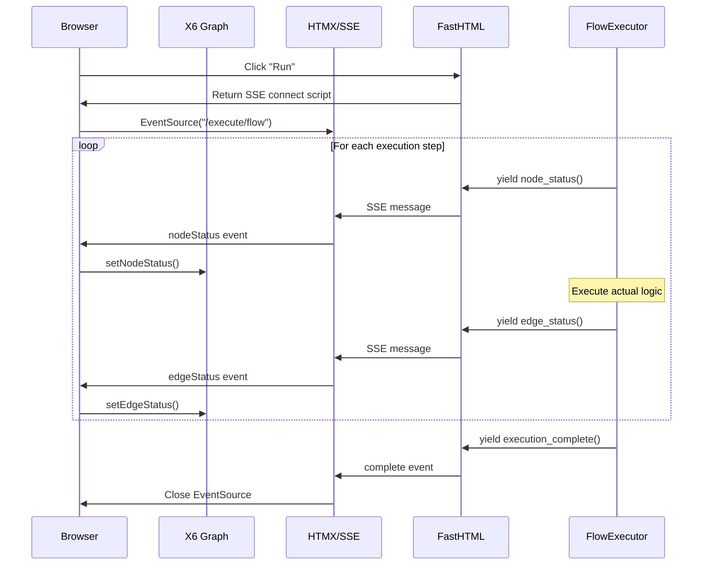

# Python-Driven Execution with SSE

Fastflow supports **Python-driven execution** using Server-Sent Events (SSE). This enables you to run workflow logic entirely in Python while providing real-time visual feedback to the browser.

## Architecture Overview



## Why Python-Based Execution?

| Approach | Pros | Cons |
|----------|------|------|
| **JavaScript** | Fast UI updates, no server round-trips | Logic in JS, hard to integrate with backend |
| **Python (SSE)** | All logic in Python, easy backend integration | Slight latency, requires SSE support |

For building agent systems, ML pipelines, or n8n-like workflow engines, Python execution is the right choice because:

1. **Backend Integration** - Call databases, APIs, ML models directly
2. **Type Safety** - Use Python dataclasses and type hints
3. **Testing** - Unit test your execution logic
4. **Debugging** - Use Python debuggers and logging
5. **Consistency** - Same language for frontend and backend logic

## Quick Start

### 1. Import the Execution Helpers

```python
from fasthtml.common import *
from fastflow import (
    FlowEditor, Node, Edge, fastflow_headers,
    FlowExecutor, ExecutionStep,
    node_status, edge_status, execution_complete,
)
```

### 2. Define Your Pipeline

```python
executor = FlowExecutor(
    graph_id="my-flow",
    steps=[
        ExecutionStep("step1", duration=1.0),
        ExecutionStep("step2", depends_on=["step1"], duration=0.5),
        ExecutionStep("step3", depends_on=["step2"], duration=0.5),
    ]
)
```

### 3. Create the SSE Endpoint

```python
@rt("/execute/my-flow")
async def execute():
    return EventStream(executor.run())
```

### 4. Connect from the UI

```python
Button("Run",
    onclick="window.fastflow.connectExecution('my-flow', '/execute/my-flow')"
)
```

## API Reference

### `node_status(node_id, status, graph_id=None, message=None)`

Create an SSE message for node status update.

```python
# Mark node as running
yield node_status("load_data", "running")

# Mark node as success
yield node_status("load_data", "success")

# Mark node as error with message
yield node_status("load_data", "error", message="File not found")
```

**Status values:**
- `pending` - Not yet started (gray)
- `running` - Currently executing (blue, thicker border)
- `success` - Completed successfully (green)
- `error` - Failed (red)
- `warning` - Completed with warnings (yellow)

### `edge_status(source_id, target_id, status, animated=False, graph_id=None)`

Create an SSE message for edge status update.

```python
# Animate edge while data is flowing
yield edge_status("step1", "step2", "running", animated=True)

# Mark edge as complete
yield edge_status("step1", "step2", "success")
```

### `execution_complete(message=None, results=None)`

Signal that execution is complete.

```python
yield execution_complete(
    message="Pipeline completed successfully!",
    results={"processed": 100, "errors": 0}
)
```

### `execution_error(message, node_id=None, details=None)`

Signal an execution error.

```python
yield execution_error(
    "Database connection failed",
    node_id="db_step",
    details={"error_code": "DB_001"}
)
```

## FlowExecutor Class

The `FlowExecutor` class provides a high-level API for executing flows with topological ordering.

### Basic Usage

```python
executor = FlowExecutor(
    graph_id="my-flow",
    steps=[
        ExecutionStep("a"),
        ExecutionStep("b", depends_on=["a"]),
        ExecutionStep("c", depends_on=["a"]),
        ExecutionStep("d", depends_on=["b", "c"]),
    ]
)
```

This creates a DAG:
```
    a
   / \
  b   c
   \ /
    d
```

Steps are automatically executed in topological order with proper dependency handling.

### With Custom Handlers

```python
async def load_data(context, inputs):
    """Load data from database."""
    import pandas as pd
    df = pd.read_sql("SELECT * FROM users", context["db"])
    return {"data": df}

async def process_data(context, inputs):
    """Process the loaded data."""
    df = inputs["load"]["data"]  # Access results from dependencies
    processed = df.dropna()
    return {"data": processed, "rows": len(processed)}

executor = FlowExecutor(
    graph_id="pipeline",
    steps=[
        ExecutionStep("load", handler=load_data),
        ExecutionStep("process", depends_on=["load"], handler=process_data),
        ExecutionStep("save", depends_on=["process"]),
    ]
)

@rt("/execute/pipeline")
async def execute():
    db = get_database_connection()
    return EventStream(executor.run_with_results(context={"db": db}))
```

### ExecutionStep Parameters

| Parameter | Type | Description |
|-----------|------|-------------|
| `node_id` | str | ID of the node in the graph |
| `depends_on` | list[str] | Node IDs this step depends on |
| `duration` | float | Simulated duration in seconds (if no handler) |
| `handler` | Callable | Async function to execute |

### Handler Signature

```python
async def my_handler(context: dict, inputs: dict) -> Any:
    """
    Args:
        context: Shared context dict passed to all handlers
        inputs: Dict mapping dependency node IDs to their results

    Returns:
        Any value that will be passed to dependent steps
    """
    pass
```

## JavaScript API

The following JavaScript functions are available for controlling execution from the browser:

### `window.fastflow.connectExecution(graphId, endpoint, options)`

Connect to an SSE endpoint for execution updates.

```javascript
window.fastflow.connectExecution('my-flow', '/execute/my-flow', {
    onComplete: (data) => console.log('Done!', data),
    onError: (error) => console.error('Error:', error),
    onProgress: (type, data) => console.log('Progress:', type, data),
});
```

### `window.fastflow.disconnectExecution(graphId)`

Disconnect an active SSE connection.

```javascript
window.fastflow.disconnectExecution('my-flow');
```

### `window.fastflow.setNodeStatus(graphId, nodeId, status)`

Manually set a node's status.

```javascript
window.fastflow.setNodeStatus('my-flow', 'node1', 'success');
```

### `window.fastflow.resetAllStatus(graphId)`

Reset all nodes and edges to their default state.

```javascript
window.fastflow.resetAllStatus('my-flow');
```

## Simple Sequential Execution

For linear pipelines without complex dependencies, use `run_sequential`:

```python
from fastflow import run_sequential

@rt("/execute/simple")
async def execute():
    return EventStream(run_sequential(
        ["step1", "step2", "step3", "step4"],
        graph_id="simple-flow",
        duration=0.5
    ))
```

## Error Handling

Handle errors gracefully in your handlers:

```python
async def risky_operation(context, inputs):
    try:
        result = await call_external_api()
        return {"data": result}
    except Exception as e:
        # The FlowExecutor will catch this and yield an error status
        raise RuntimeError(f"API call failed: {e}")
```

Or handle errors manually in a custom generator:

```python
@rt("/execute/custom")
async def execute():
    async def run():
        try:
            yield node_status("step1", "running")
            await do_work()
            yield node_status("step1", "success")
        except Exception as e:
            yield node_status("step1", "error", message=str(e))
            yield execution_error(str(e), node_id="step1")
            return

        yield execution_complete()

    return EventStream(run())
```

## Callback System

FlowExecutor supports a **two-way callback system** inspired by fastai. Callbacks can read and modify execution state at each stage.

### Built-in Callbacks

```python
from fastflow import FlowExecutor, ExecutionStep
from fastflow.callbacks import (
    SSECallback,        # Real-time browser updates (auto-added)
    LoggingCallback,    # Structured logging
    TimingCallback,     # Performance metrics
    RetryCallback,      # Auto-retry on failure
    ProgressCallback,   # Progress percentage tracking
)

executor = FlowExecutor(
    graph_id="my-flow",
    steps=[...],
    callbacks=[
        SSECallback(),
        LoggingCallback(),
        TimingCallback(),
        ProgressCallback(),
    ]
)
```

### Custom Callbacks

Create custom callbacks by subclassing `FlowCallback`:

```python
from fastflow.callbacks import FlowCallback, FlowState

class MetricsCallback(FlowCallback):
    """Collect execution metrics."""
    order = 20  # Higher = runs later

    def __init__(self):
        self.metrics = {}

    def before_flow(self, state: FlowState):
        """Called once before execution starts."""
        state.context["started_at"] = time.time()

    def before_node(self, state: FlowState):
        """Called before each node executes."""
        node_id = state.current_step.node_id
        self.metrics[f"{node_id}_start"] = time.time()

    def after_node(self, state: FlowState):
        """Called after each node completes."""
        node_id = state.current_step.node_id
        elapsed = time.time() - self.metrics[f"{node_id}_start"]
        state.context["step_times"][node_id] = elapsed

    def after_flow(self, state: FlowState):
        """Called once after execution completes."""
        save_metrics(self.metrics)

    def on_error(self, state: FlowState, exc: Exception):
        """Called when an error occurs."""
        log_error(exc, state.current_step.node_id)
```

### Control Flow Exceptions

Callbacks can control execution flow using special exceptions:

```python
from fastflow.callbacks import (
    FlowCallback, FlowState,
    SkipNodeException,    # Skip current node
    CancelFlowException,  # Cancel entire flow
    RetryNodeException,   # Retry current node
)

class ConditionalCallback(FlowCallback):
    def before_node(self, state: FlowState):
        # Skip optional nodes based on context
        if state.current_step.node_id == "optional":
            if not state.context.get("run_optional"):
                raise SkipNodeException("Skipping optional step")

        # Cancel flow if too many errors
        if len(state.errors) > 3:
            raise CancelFlowException("Too many errors")

    def on_error(self, state: FlowState, exc: Exception):
        # Auto-retry transient errors
        if is_transient_error(exc):
            raise RetryNodeException("Retrying after transient error")
```

### FlowState Object

The `FlowState` object is passed to all callbacks and contains mutable execution state:

```python
@dataclass
class FlowState:
    graph_id: str                    # Flow identifier
    steps: list[ExecutionStep]       # All execution steps
    results: dict[str, Any]          # Results from each node
    errors: dict[str, Exception]     # Errors from each node
    current_step: ExecutionStep      # Currently executing step
    current_node: FlowNode           # Typed node (if any)
    context: dict                    # Shared context (mutable!)
    cancelled: bool                  # Whether flow was cancelled
    node_times: dict[str, float]     # Timing per node
    progress: float                  # 0.0 to 1.0
```

Callbacks can modify `state.context`, `state.results`, and other fields to influence execution.

## Best Practices

1. **Keep handlers focused** - Each handler should do one thing
2. **Use context for shared state** - Pass database connections, configs via context
3. **Handle errors explicitly** - Don't let exceptions crash silently
4. **Test handlers independently** - Unit test each handler function
5. **Use appropriate durations** - Set realistic durations for simulations
6. **Clean up resources** - Use try/finally for cleanup in handlers
7. **Order callbacks carefully** - Use `order` attribute to control execution order
8. **Don't block in callbacks** - Keep callback methods fast

## Example: Real ML Pipeline

```python
from fasthtml.common import *
from fastflow import FlowExecutor, ExecutionStep, fastflow_headers
import pandas as pd
from sklearn.model_selection import train_test_split
from sklearn.ensemble import RandomForestClassifier
from sklearn.metrics import accuracy_score

async def load_data(ctx, inputs):
    df = pd.read_csv(ctx["data_path"])
    return {"df": df}

async def preprocess(ctx, inputs):
    df = inputs["load"]["df"]
    df = df.dropna()
    return {"df": df}

async def split_data(ctx, inputs):
    df = inputs["preprocess"]["df"]
    X = df.drop("target", axis=1)
    y = df["target"]
    X_train, X_test, y_train, y_test = train_test_split(X, y, test_size=0.2)
    return {"X_train": X_train, "X_test": X_test, "y_train": y_train, "y_test": y_test}

async def train_model(ctx, inputs):
    data = inputs["split"]
    model = RandomForestClassifier()
    model.fit(data["X_train"], data["y_train"])
    return {"model": model}

async def evaluate(ctx, inputs):
    model = inputs["train"]["model"]
    data = inputs["split"]
    predictions = model.predict(data["X_test"])
    accuracy = accuracy_score(data["y_test"], predictions)
    return {"accuracy": accuracy}

executor = FlowExecutor(
    graph_id="ml-pipeline",
    steps=[
        ExecutionStep("load", handler=load_data),
        ExecutionStep("preprocess", depends_on=["load"], handler=preprocess),
        ExecutionStep("split", depends_on=["preprocess"], handler=split_data),
        ExecutionStep("train", depends_on=["split"], handler=train_model),
        ExecutionStep("evaluate", depends_on=["train", "split"], handler=evaluate),
    ]
)

app, rt = fast_app(hdrs=fastflow_headers())

@rt("/execute/ml")
async def execute_ml():
    return EventStream(executor.run_with_results(
        context={"data_path": "data/training.csv"}
    ))
```

## Related Documentation

- [Architecture Guide](./architecture.md) - Overall Fastflow architecture
- [ML Pipeline Tutorial](../tutorials/ai-model-dag.md) - Step-by-step ML pipeline tutorial
- [FastHTML SSE](https://fastht.ml/) - FastHTML SSE documentation
