# Tutorial: Building an Agent Orchestration Flow

In this advanced tutorial, you'll build a complex agent orchestration system. This represents AI agents that can route to different tools, query knowledge bases, execute code, and interact with external services via MCP (Model Context Protocol).

## What You'll Build

```mermaid
flowchart TD
    START([__start__]) --> ROUTER[🧠 LLM Router]

    ROUTER -->|code| CODE[💻 Code Exec]
    ROUTER -->|search| KB[📚 Query KB]
    ROUTER -->|tool| MCP[🔌 MCP Tool]

    CODE --> DB[🗄️ Save to DB]
    KB --> DB
    MCP --> DB

    DB --> LOOP{🔁 Loop?}
    LOOP -->|done| END([__end__])
    LOOP -.->|continue| ROUTER

    style START fill:#1e293b,color:#fff
    style END fill:#1e293b,color:#fff
    style ROUTER fill:#f3e8ff,stroke:#c4b5fd
    style CODE fill:#e0f2fe,stroke:#7dd3fc
    style KB fill:#dcfce7,stroke:#86efac
    style MCP fill:#ccfbf1,stroke:#5eead4
    style DB fill:#f1f5f9,stroke:#94a3b8
    style LOOP fill:#fef3c7,stroke:#fcd34d
```



**Legend:**
- Dark rounded = Start/End nodes
- Purple = LLM Router
- Blue = Code execution
- Green = Knowledge base
- Teal = MCP external tool
- Gray = Database
- Yellow = Loop decision
- Dashed = Loop back edge

## Prerequisites

- Completed previous tutorials (recommended)
- Fastflow installed

---

## Step 1: Create the Base Application

Create `agent_flow_tutorial.py`:

```python
from fasthtml.common import *
from fastflow import FlowEditor, fastflow_headers

app, rt = fast_app(hdrs=fastflow_headers())

@rt
def index():
    return Titled("Agent Orchestration",
        FlowEditor(
            id="agent-flow",
        )
    )

serve()
```

---

## Step 2: Use AgentNode for Specialized Nodes

The `AgentNode` component provides specialized styling for agent workflows:

```python
from fastflow import FlowEditor, AgentNode, fastflow_headers

@rt
def index():
    return Titled("Agent Orchestration",
        FlowEditor(
            AgentNode(
                "llm_router",
                x=300, y=100,
                label="LLM Router",
                node_type="llm",      # Purple LLM styling
            ),
            id="agent-flow",
        )
    )
```

**Available AgentNode types:**
- `llm` - Language model (purple)
- `code` - Code execution (blue)
- `branch` - Decision branch (orange)
- `loop` - Loop iteration (cyan)
- `kb` - Knowledge base (green)
- `mcp` - MCP tool (teal)
- `db` - Database (gray)

---

## Step 3: Build the Start and Router

```python
from fastflow import FlowEditor, AgentNode, Node, fastflow_headers

@rt
def index():
    return Titled("Agent Orchestration",
        FlowEditor(
            # Entry point
            Node("__start__", x=300, y=50, label="__start__",
                 node_type="start", inputs=0, outputs=1),

            # LLM Router - routes to different tools
            AgentNode("llm_router", x=300, y=150, label="LLM Router",
                     node_type="llm",
                     inputs=1,
                     outputs=3),  # Three outputs for different routes

            id="agent-flow",
        )
    )
```

---

## Step 4: Add Tool Nodes

Create three different tool paths:

```python
# Code execution tool
AgentNode("code_exec", x=100, y=280, label="Code Exec",
         node_type="code"),

# Knowledge base query
AgentNode("query_kb", x=300, y=280, label="Query KB",
         node_type="kb"),

# External MCP tool
AgentNode("mcp_tool", x=500, y=280, label="MCP Tool",
         node_type="mcp"),
```

---

## Step 5: Add Database and End Nodes

Complete the flow with aggregation and completion:

```python
# Database storage
AgentNode("save_db", x=300, y=400, label="Save to DB",
         node_type="db",
         inputs=3,  # Receives from all three tools
         outputs=1),

# End node
Node("__end__", x=300, y=520, label="__end__",
     node_type="end", inputs=1, outputs=0),
```

---

## Step 6: Connect Everything with Edges

```python
from fastflow import FlowEditor, AgentNode, Node, Edge, fastflow_headers

# Entry to router
Edge(source="__start__", target="llm_router"),

# Router to each tool (fan-out)
Edge(source="llm_router", target="code_exec",
     label="code", source_port=0),
Edge(source="llm_router", target="query_kb",
     label="search", source_port=1),
Edge(source="llm_router", target="mcp_tool",
     label="tool", source_port=2),

# Tools to database (fan-in)
Edge(source="code_exec", target="save_db", target_port=0),
Edge(source="query_kb", target="save_db", target_port=1),
Edge(source="mcp_tool", target="save_db", target_port=2),

# Database to end
Edge(source="save_db", target="__end__"),
```

---

## Step 7: Add a Loop Node

Let's add a loop back from the database to the router for iterative processing:

```python
# Loop node - decides if more iterations needed
AgentNode("loop_check", x=500, y=400, label="Loop?",
         node_type="loop",
         inputs=1, outputs=2),

# Modify save_db to output to loop check instead of end
# Update edges:
Edge(source="save_db", target="loop_check"),
Edge(source="loop_check", target="__end__", label="done", source_port=0),
Edge(source="loop_check", target="llm_router", label="continue",
     dashed=True, source_port=1),  # Loop back
```

---

## Step 8: Add the Node Palette

```python
from fastflow import NodePalette, PaletteItem, PaletteGroup

@rt
def index():
    return Titled("Agent Orchestration",
        Div(
            # Sidebar
            Aside(
                H3("Agent Builder", style="margin: 0 0 16px 0; font-size: 14px;"),
                P("Build AI agent workflows with tools and knowledge bases.",
                  style="font-size: 12px; color: #666; margin-bottom: 16px;"),

                NodePalette(
                    PaletteGroup(
                        PaletteItem("start", "START", inputs=0, outputs=1),
                        PaletteItem("end", "END", inputs=1, outputs=0),
                        title="Flow Control"
                    ),
                    PaletteGroup(
                        PaletteItem("llm", "LLM", icon="🧠", inputs=1, outputs=2),
                        PaletteItem("code", "CODE", icon="💻", inputs=1, outputs=1),
                        PaletteItem("branch", "BRANCH", icon="🔀", inputs=1, outputs=2),
                        PaletteItem("loop", "LOOP", icon="🔁", inputs=1, outputs=2),
                        title="Processing"
                    ),
                    PaletteGroup(
                        PaletteItem("kb", "KB", icon="📚", inputs=1, outputs=1),
                        PaletteItem("mcp", "MCP", icon="🔌", inputs=1, outputs=1),
                        PaletteItem("db", "DB", icon="🗄️", inputs=1, outputs=1),
                        title="External"
                    ),
                    target_editor="agent-flow"
                ),

                H4("Node Types", style="margin: 20px 0 8px 0; font-size: 12px; color: #64748b;"),
                Div(
                    P("🧠 LLM - Language model processing", style="margin: 2px 0; font-size: 11px;"),
                    P("💻 CODE - Python/JS execution", style="margin: 2px 0; font-size: 11px;"),
                    P("📚 KB - Knowledge base query", style="margin: 2px 0; font-size: 11px;"),
                    P("🔌 MCP - External tool via MCP", style="margin: 2px 0; font-size: 11px;"),
                    P("🗄️ DB - Database operations", style="margin: 2px 0; font-size: 11px;"),
                    P("🔀 BRANCH - Conditional routing", style="margin: 2px 0; font-size: 11px;"),
                    P("🔁 LOOP - Iteration control", style="margin: 2px 0; font-size: 11px;"),
                    style="padding: 10px; background: #f8fafc; border-radius: 6px; color: #64748b;"
                ),

                style="width: 220px; padding: 16px; background: #fff; border-right: 1px solid #e2e8f0;"
            ),
            # Main editor
            Main(
                FlowEditor(
                    # ... nodes and edges ...
                    id="agent-flow",
                    on_change="/flow/changed",
                ),
                style="flex: 1;"
            ),
            style="display: flex; height: 100vh;"
        )
    )
```

---

## Step 9: Handle Server-Side Events

Process agent flow events on the server:

```python
import json

@rt("/flow/changed")
def post(event: str, data: str, flow: str):
    """Handle agent flow events."""
    event_data = json.loads(data) if data else {}
    flow_data = json.loads(flow) if flow else {}

    if event == "nodeSelected":
        node_type = event_data.get('data', {}).get('nodeType', 'unknown')
        print(f"Selected {node_type} node: {event_data.get('id')}")

    elif event == "edgeConnected":
        source = event_data.get('source')
        target = event_data.get('target')
        print(f"Connected: {source} -> {target}")

        # Validate connection rules
        if not validate_connection(source, target, flow_data):
            return Script(f"alert('Invalid connection: {source} cannot connect to {target}')")

    return ""

def validate_connection(source_id, target_id, flow):
    """Validate that a connection follows agent workflow rules."""
    # Example: Prevent loops directly back to start
    if target_id == "__start__":
        return False
    return True
```

---

## Complete Code

```python
from fasthtml.common import *
from fastflow import (
    FlowEditor, Node, Edge, AgentNode,
    NodePalette, PaletteItem, PaletteGroup,
    fastflow_headers
)
import json

app, rt = fast_app(hdrs=fastflow_headers())

@rt
def index():
    return Titled("Agent Orchestration",
        Div(
            # Sidebar
            Aside(
                H3("Agent Builder", style="margin: 0 0 16px 0; font-size: 14px;"),
                P("Build AI agent workflows with tools and knowledge bases.",
                  style="font-size: 12px; color: #666; margin-bottom: 16px;"),

                NodePalette(
                    PaletteGroup(
                        PaletteItem("start", "START", inputs=0, outputs=1),
                        PaletteItem("end", "END", inputs=1, outputs=0),
                        title="Flow Control"
                    ),
                    PaletteGroup(
                        PaletteItem("llm", "LLM", icon="🧠", inputs=1, outputs=2),
                        PaletteItem("code", "CODE", icon="💻", inputs=1, outputs=1),
                        PaletteItem("branch", "BRANCH", icon="🔀", inputs=1, outputs=2),
                        PaletteItem("loop", "LOOP", icon="🔁", inputs=1, outputs=2),
                        title="Processing"
                    ),
                    PaletteGroup(
                        PaletteItem("kb", "KB", icon="📚", inputs=1, outputs=1),
                        PaletteItem("mcp", "MCP", icon="🔌", inputs=1, outputs=1),
                        PaletteItem("db", "DB", icon="🗄️", inputs=1, outputs=1),
                        title="External"
                    ),
                    target_editor="agent-flow"
                ),

                H4("Node Types", style="margin: 20px 0 8px 0; font-size: 12px; color: #64748b;"),
                Div(
                    P("🧠 LLM - Language model", style="margin: 2px 0; font-size: 11px;"),
                    P("💻 CODE - Code execution", style="margin: 2px 0; font-size: 11px;"),
                    P("📚 KB - Knowledge base", style="margin: 2px 0; font-size: 11px;"),
                    P("🔌 MCP - MCP tool", style="margin: 2px 0; font-size: 11px;"),
                    P("🗄️ DB - Database", style="margin: 2px 0; font-size: 11px;"),
                    style="padding: 10px; background: #f8fafc; border-radius: 6px; color: #64748b;"
                ),

                style="width: 220px; padding: 16px; background: #fff; border-right: 1px solid #e2e8f0;"
            ),
            # Main editor
            Main(
                FlowEditor(
                    # Start
                    Node("__start__", x=300, y=50, label="__start__",
                         node_type="start", inputs=0, outputs=1),

                    # LLM Router
                    AgentNode("llm_router", x=300, y=150, label="LLM Router",
                             node_type="llm", inputs=1, outputs=3),

                    # Tool nodes
                    AgentNode("code_exec", x=100, y=280, label="Code Exec",
                             node_type="code"),
                    AgentNode("query_kb", x=300, y=280, label="Query KB",
                             node_type="kb"),
                    AgentNode("mcp_tool", x=500, y=280, label="MCP Tool",
                             node_type="mcp"),

                    # Aggregation
                    AgentNode("save_db", x=300, y=400, label="Save to DB",
                             node_type="db", inputs=3, outputs=1),

                    # Loop check
                    AgentNode("loop_check", x=500, y=480, label="Loop?",
                             node_type="loop", inputs=1, outputs=2),

                    # End
                    Node("__end__", x=300, y=580, label="__end__",
                         node_type="end", inputs=1, outputs=0),

                    # Edges - Entry
                    Edge(source="__start__", target="llm_router"),

                    # Edges - Router fan-out
                    Edge(source="llm_router", target="code_exec",
                         label="code", source_port=0),
                    Edge(source="llm_router", target="query_kb",
                         label="search", source_port=1),
                    Edge(source="llm_router", target="mcp_tool",
                         label="tool", source_port=2),

                    # Edges - Tool fan-in
                    Edge(source="code_exec", target="save_db", target_port=0),
                    Edge(source="query_kb", target="save_db", target_port=1),
                    Edge(source="mcp_tool", target="save_db", target_port=2),

                    # Edges - Loop
                    Edge(source="save_db", target="loop_check"),
                    Edge(source="loop_check", target="__end__",
                         label="done", source_port=0),
                    Edge(source="loop_check", target="llm_router",
                         label="continue", dashed=True, source_port=1),

                    id="agent-flow",
                    on_change="/flow/changed",
                ),
                style="flex: 1;"
            ),
            style="display: flex; height: 100vh;"
        )
    )

@rt("/flow/changed")
def post(event: str, data: str, flow: str):
    event_data = json.loads(data) if data else {}
    print(f"Agent Flow Event: {event}, Data: {event_data}")
    return ""

serve()
```

---

## What You Learned

1. **AgentNode component** with specialized agent workflow types
2. **Fan-out patterns** - Router with multiple output paths
3. **Fan-in patterns** - Database aggregating from multiple tools
4. **Loop constructs** - Iterative agent processing
5. **Conditional routing** with labeled edges
6. **Grouped palette** organizing node types by category

---

## Agent Flow Patterns

### Router Pattern
```
        ┌───▶ Tool A
Router ─┼───▶ Tool B
        └───▶ Tool C
```
Use `outputs=3` and `source_port=0,1,2` on edges.

### Aggregator Pattern
```
Tool A ─┬──▶ Aggregator
Tool B ─┤
Tool C ─┘
```
Use `inputs=3` and `target_port=0,1,2` on edges.

### Loop Pattern
```
┌──────────────────────┐
│                      ▼
│  Process ──▶ Check Loop ──▶ End
│                │
└────────────────┘
```
Use `dashed=True` for the loop-back edge.

---

## Next Steps

- Add **prompt templates** as node configuration
- Implement **actual MCP connections** for real tools
- Add **execution tracing** to show agent decisions
- Create **agent templates** for common patterns

Continue to the next tutorial: [Traditional Flowchart](./flowchart.md)
