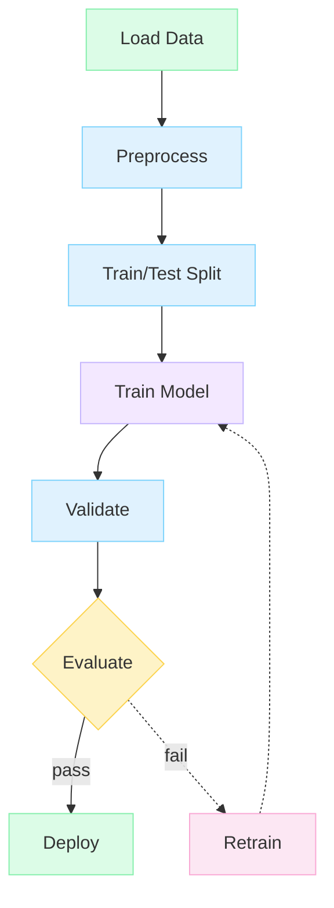
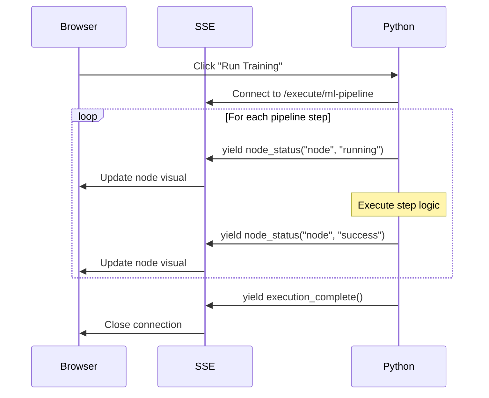

# Tutorial: Building an AI/ML Training Pipeline Editor

In this tutorial, you'll build a machine learning training pipeline editor. Unlike the horizontal data DAG, this uses a more traditional top-to-bottom flow with conditional branches (pass/fail evaluation) and retrain loops.

## What You'll Build



**Legend:**
- Green = Input/Output (Load Data, Deploy)
- Blue = Transform (Preprocess, Split, Validate)
- Purple = ML Model (Train Model)
- Yellow = Decision (Evaluate)
- Pink = Retry (Retrain)
- Dashed = Conditional/failure path

## Prerequisites

- Completed the [Data Processing DAG Tutorial](./data-processing-dag.md) (recommended)
- Fastflow installed

---

## Step 1: Create the Base Application

Create `ml_pipeline_tutorial.py`:

```python
from fasthtml.common import *
from fastflow import FlowEditor, Node, Edge, fastflow_headers

app, rt = fast_app(hdrs=fastflow_headers())

@rt
def index():
    return Titled("ML Training Pipeline",
        FlowEditor(
            id="ml-pipeline",
        )
    )

serve()
```

---

## Step 2: Create the Data Preparation Nodes

For ML pipelines, we'll use the standard `Node` component with appropriate node types:

```python
@rt
def index():
    return Titled("ML Training Pipeline",
        FlowEditor(
            # Data loading
            Node("data_load",
                 x=200, y=50,
                 label="Load Data",
                 node_type="input",      # Input styling (green tint)
                 inputs=0, outputs=1,
                 width=140, height=50),

            # Preprocessing
            Node("preprocess",
                 x=200, y=150,
                 label="Preprocess",
                 node_type="transform",  # Transform styling
                 width=140, height=50),

            # Train/test split
            Node("split",
                 x=200, y=250,
                 label="Train/Test Split",
                 node_type="transform",
                 width=140, height=50),

            id="ml-pipeline",
        )
    )
```

---

## Step 3: Add Training and Validation Nodes

```python
# Model training
Node("train_model",
     x=400, y=200,
     label="Train Model",
     node_type="llm",         # Purple styling (AI/ML related)
     width=140, height=50),

# Validation
Node("validate",
     x=400, y=300,
     label="Validate",
     node_type="agent",       # Blue styling
     width=140, height=50),
```

---

## Step 4: Add Evaluation with Conditional Outputs

The evaluation node has two outputs - one for passing models (deploy) and one for failing models (retrain):

```python
# Evaluation - conditional node with 2 outputs
Node("evaluate",
     x=550, y=250,
     label="Evaluate",
     node_type="condition",   # Yellow/orange conditional styling
     width=140, height=50,
     outputs=2),              # Two outputs: pass and fail
```

---

## Step 5: Add Deploy and Retrain Nodes

```python
# Deploy - success path
Node("deploy",
     x=700, y=150,
     label="Deploy",
     node_type="output",      # Output styling
     inputs=1, outputs=0,
     width=140, height=50),

# Retrain - failure path (loops back)
Node("retrain",
     x=700, y=350,
     label="Retrain",
     node_type="tool",        # Pink tool styling
     width=140, height=50),
```

---

## Step 6: Connect the Nodes

Wire everything together with edges, including the retrain loop:

```python
# Main pipeline flow
Edge(source="data_load", target="preprocess"),
Edge(source="preprocess", target="split"),
Edge(source="split", target="train_model"),
Edge(source="train_model", target="validate"),
Edge(source="validate", target="evaluate"),

# Conditional branches from evaluate
Edge(source="evaluate", target="deploy",
     label="pass",
     source_port=0),          # First output port

Edge(source="evaluate", target="retrain",
     label="fail",
     dashed=True,             # Dashed for conditional/failure path
     source_port=1),          # Second output port

# Retrain loop back to training
Edge(source="retrain", target="train_model",
     dashed=True),
```

---

## Step 7: Python-Based Execution with SSE

Fastflow supports **Python-driven execution** using Server-Sent Events (SSE). This keeps all logic in Python while providing real-time visual updates to the browser.



### Import the Execution Helpers

```python
from fasthtml.common import *
from fastflow import (
    FlowEditor, Node, Edge, fastflow_headers,
    FlowExecutor, ExecutionStep,  # Python execution support
    node_status, edge_status, execution_complete,
)
```

### Define the Pipeline Steps

```python
# Define execution steps with dependencies
executor = FlowExecutor(
    graph_id="ml-pipeline",
    steps=[
        ExecutionStep("data_load", duration=0.8),
        ExecutionStep("preprocess", depends_on=["data_load"], duration=0.8),
        ExecutionStep("split", depends_on=["preprocess"], duration=0.8),
        ExecutionStep("train_model", depends_on=["split"], duration=2.0),  # Training takes longer
        ExecutionStep("validate", depends_on=["train_model"], duration=0.8),
        ExecutionStep("evaluate", depends_on=["validate"], duration=0.8),
        ExecutionStep("deploy", depends_on=["evaluate"], duration=0.8),
    ]
)
```

---

## Step 8: Add the SSE Endpoint

Create a route that streams execution updates:

```python
@rt("/execute/ml-pipeline")
async def execute_pipeline():
    """SSE endpoint that executes the ML pipeline and streams status updates."""
    return EventStream(executor.run())
```

### Add the UI Controls

```python
@rt
def index():
    return Titled("ML Training Pipeline",
        Div(
            # Sidebar
            Aside(
                H3("ML Pipeline", style="margin: 0 0 16px 0; font-size: 14px;"),
                P("Training pipeline with status indicators",
                  style="font-size: 12px; color: #666; margin-bottom: 16px;"),

                # Status legend
                Div(
                    Span("●", style="color: #52c41a;"), " Success",
                    Br(),
                    Span("●", style="color: #1890ff;"), " Running",
                    Br(),
                    Span("●", style="color: #ff4d4f;"), " Failed",
                    style="font-size: 12px; margin-top: 20px; padding: 10px; background: #f8f8f8; border-radius: 6px;"
                ),

                # Controls - Python-driven execution
                Div(
                    Button("▶ Run Training", id="run-btn",
                           onclick="window.fastflow.connectExecution('ml-pipeline', '/execute/ml-pipeline', {onComplete: () => document.getElementById('run-btn').disabled = false}); this.disabled = true;",
                           style="width: 100%; margin-top: 16px; padding: 10px; background: #8b5cf6; color: white; border: none; border-radius: 6px; cursor: pointer; font-weight: 500;"),
                    Button("↺ Reset",
                           onclick="window.fastflow.resetAllStatus('ml-pipeline')",
                           style="width: 100%; margin-top: 8px; padding: 8px; background: #f1f5f9; color: #64748b; border: 1px solid #e2e8f0; border-radius: 6px; cursor: pointer;"),
                ),

                style="width: 220px; padding: 16px; background: #fff; border-right: 1px solid #e2e8f0;"
            ),
            # Main editor
            Main(
                FlowEditor(
                    # ... all nodes and edges ...
                    id="ml-pipeline",
                ),
                style="flex: 1;"
            ),
            style="display: flex; height: 100vh;"
        )
    )
```

---

## Step 9: Custom Execution Logic (Optional)

For real ML pipelines, you can add actual handlers to each step:

```python
async def load_data(context, inputs):
    """Load training data."""
    # Your actual data loading logic here
    import pandas as pd
    data = pd.read_csv("training_data.csv")
    return {"data": data, "rows": len(data)}

async def train_model(context, inputs):
    """Train the ML model."""
    # Your actual training logic here
    from sklearn.ensemble import RandomForestClassifier
    model = RandomForestClassifier()
    # model.fit(X_train, y_train)
    return {"model": model, "accuracy": 0.95}

# Create executor with handlers
executor = FlowExecutor(
    graph_id="ml-pipeline",
    steps=[
        ExecutionStep("data_load", handler=load_data),
        ExecutionStep("preprocess", depends_on=["data_load"]),
        ExecutionStep("split", depends_on=["preprocess"]),
        ExecutionStep("train_model", depends_on=["split"], handler=train_model),
        ExecutionStep("validate", depends_on=["train_model"]),
        ExecutionStep("evaluate", depends_on=["validate"]),
        ExecutionStep("deploy", depends_on=["evaluate"]),
    ]
)

@rt("/execute/ml-pipeline")
async def execute_pipeline():
    return EventStream(executor.run_with_results(context={"config": "prod"}))
```

---

## Complete Code

```python
from fasthtml.common import *
from fastflow import (
    FlowEditor, Node, Edge, fastflow_headers,
    FlowExecutor, ExecutionStep,
)

app, rt = fast_app(hdrs=fastflow_headers())

# Define execution pipeline with dependencies
executor = FlowExecutor(
    graph_id="ml-pipeline",
    steps=[
        ExecutionStep("data_load", duration=0.8),
        ExecutionStep("preprocess", depends_on=["data_load"], duration=0.8),
        ExecutionStep("split", depends_on=["preprocess"], duration=0.8),
        ExecutionStep("train_model", depends_on=["split"], duration=2.0),
        ExecutionStep("validate", depends_on=["train_model"], duration=0.8),
        ExecutionStep("evaluate", depends_on=["validate"], duration=0.8),
        ExecutionStep("deploy", depends_on=["evaluate"], duration=0.8),
    ]
)

@rt
def index():
    return Titled("ML Training Pipeline",
        Div(
            # Sidebar
            Aside(
                H3("ML Pipeline", style="margin: 0 0 16px 0; font-size: 14px;"),
                P("Training pipeline with Python-driven execution",
                  style="font-size: 12px; color: #666; margin-bottom: 16px;"),
                Div(
                    Span("●", style="color: #52c41a;"), " Success",
                    Br(),
                    Span("●", style="color: #1890ff;"), " Running",
                    Br(),
                    Span("●", style="color: #ff4d4f;"), " Failed",
                    style="font-size: 12px; margin-top: 20px; padding: 10px; background: #f8f8f8; border-radius: 6px;"
                ),
                Div(
                    Button("▶ Run Training", id="run-btn",
                           onclick="window.fastflow.connectExecution('ml-pipeline', '/execute/ml-pipeline', {onComplete: () => document.getElementById('run-btn').disabled = false}); this.disabled = true;",
                           style="width: 100%; margin-top: 16px; padding: 10px; background: #8b5cf6; color: white; border: none; border-radius: 6px; cursor: pointer; font-weight: 500;"),
                    Button("↺ Reset",
                           onclick="window.fastflow.resetAllStatus('ml-pipeline')",
                           style="width: 100%; margin-top: 8px; padding: 8px; background: #f1f5f9; color: #64748b; border: 1px solid #e2e8f0; border-radius: 6px; cursor: pointer;"),
                ),
                style="width: 220px; padding: 16px; background: #fff; border-right: 1px solid #e2e8f0;"
            ),
            # Main editor
            Main(
                FlowEditor(
                    # Data preparation
                    Node("data_load", x=100, y=50, label="Load Data", node_type="input",
                         inputs=0, outputs=1, width=130, height=50),
                    Node("preprocess", x=100, y=150, label="Preprocess", node_type="transform",
                         width=130, height=50),
                    Node("split", x=100, y=250, label="Train/Test Split", node_type="transform",
                         width=130, height=50),

                    # Model training branch
                    Node("train_model", x=300, y=200, label="Train Model", node_type="llm",
                         width=130, height=50),
                    Node("validate", x=300, y=300, label="Validate", node_type="agent",
                         width=130, height=50),

                    # Evaluation
                    Node("evaluate", x=500, y=250, label="Evaluate", node_type="condition",
                         width=130, height=50, outputs=2),
                    Node("deploy", x=650, y=150, label="Deploy", node_type="output",
                         inputs=1, outputs=0, width=130, height=50),
                    Node("retrain", x=650, y=350, label="Retrain", node_type="tool",
                         width=130, height=50),

                    # Connections
                    Edge(source="data_load", target="preprocess"),
                    Edge(source="preprocess", target="split"),
                    Edge(source="split", target="train_model"),
                    Edge(source="train_model", target="validate"),
                    Edge(source="validate", target="evaluate"),
                    Edge(source="evaluate", target="deploy", label="pass", source_port=0),
                    Edge(source="evaluate", target="retrain", label="fail", source_port=1, dashed=True),
                    Edge(source="retrain", target="train_model", dashed=True),

                    id="ml-pipeline",
                ),
                style="flex: 1;"
            ),
            style="display: flex; height: 100vh;"
        ),
    )

@rt("/execute/ml-pipeline")
async def execute_pipeline():
    """SSE endpoint - all execution logic is in Python!"""
    return EventStream(executor.run())

serve()
```

---

## What You Learned

1. **Mixed node types** for different pipeline stages (input, transform, llm, condition, output)
2. **Conditional branching** with multiple output ports
3. **Feedback loops** (retrain → train_model)
4. **Dashed edges** for conditional/failure paths
5. **Python-based execution** using `FlowExecutor` and `ExecutionStep`
6. **SSE streaming** for real-time visual updates from Python
7. **Custom handlers** for actual ML logic in each step

---

## Key Differences from Data DAG

| Aspect | Data DAG | ML Pipeline |
|--------|----------|-------------|
| Flow direction | Left-to-right | Top-to-bottom |
| Port positions | Sides (left/right) | Default (top/bottom) |
| Branching | Fan-in (join) | Fan-out (conditional) |
| Loops | None | Retrain feedback |
| Status display | Inside node | Border color |

---

## Next Steps

- Add **hyperparameter tuning** node with grid search
- Implement **model versioning** with MLflow integration
- Add **A/B testing** branches for model comparison
- Create **model registry** endpoint for deployments

Continue to the next tutorial: [Agent Orchestration Flow](./agent-flow.md)
