# Tutorial: Building a Data Processing DAG Editor

In this tutorial, you'll build a data pipeline visualization tool similar to Apache Airflow, dbt, or Dagster. You'll create a left-to-right DAG (Directed Acyclic Graph) with input sources, transformations, and outputs - complete with an animated execution simulation.

## What You'll Build

```mermaid
flowchart LR
    subgraph Sources
        INPUT1[📥 Users CSV]
        INPUT2[🗄️ Orders DB]
    end

    subgraph Transform
        FILTER1[🔍 Filter Active]
        FILTER2[🔍 Filter Recent]
        JOIN[🔗 Join Data]
        AGG[∑ Aggregate]
    end

    subgraph Output
        EXPORT[📤 Export CSV]
    end

    INPUT1 --> FILTER1
    INPUT2 --> FILTER2
    FILTER1 --> JOIN
    FILTER2 --> JOIN
    JOIN --> AGG
    AGG --> EXPORT

    style INPUT1 fill:#dcfce7,stroke:#86efac
    style INPUT2 fill:#dcfce7,stroke:#86efac
    style FILTER1 fill:#e0f2fe,stroke:#7dd3fc
    style FILTER2 fill:#e0f2fe,stroke:#7dd3fc
    style JOIN fill:#fef3c7,stroke:#fcd34d
    style AGG fill:#f3e8ff,stroke:#c4b5fd
    style EXPORT fill:#fee2e2,stroke:#fca5a5
```



**Legend:**
- Green = Input sources
- Blue = Filter operations
- Yellow = Join operation
- Purple = Aggregation
- Red = Output destination

## Prerequisites

- Completed the [ER Diagram Tutorial](./er-diagram.md) (recommended)
- Fastflow installed (`uv add fastflow`)

---

## Step 1: Create the Basic Application

Create a new file `data_dag_tutorial.py`:

```python
from fasthtml.common import *
from fastflow import FlowEditor, fastflow_headers

app, rt = fast_app(hdrs=fastflow_headers())

@rt
def index():
    return Titled("Data Processing Pipeline",
        FlowEditor(
            id="data-dag",
        )
    )

serve()
```

---

## Step 2: Create DAG Nodes

Use the specialized `DAGNode` component for data pipeline nodes:

```python
from fastflow import FlowEditor, DAGNode, fastflow_headers

@rt
def index():
    return Titled("Data Processing Pipeline",
        FlowEditor(
            # Input source
            DAGNode(
                "input1",
                x=50, y=100,
                label="Users CSV",
                node_type="input",       # Input node styling
                icon="📥",               # Icon displayed in node
                inputs=0,                # No input ports (it's a source)
                outputs=1,               # One output
            ),
            id="data-dag",
        )
    )
```

**DAGNode parameters:**
- `node_type`: Styling - `input`, `output`, `filter`, `join`, `union`, `agg`, `transform`
- `icon`: Emoji displayed in the node
- `inputs`/`outputs`: Port counts
- `status`: Optional status indicator - `success`, `running`, `pending`, `error`

---

## Step 3: Configure Horizontal Flow

DAG pipelines typically flow left-to-right. Use `port_positions` to place ports on the sides:

```python
DAGNode("input1", x=50, y=100, label="Users CSV",
        node_type="input", icon="📥",
        inputs=0, outputs=1,
        port_positions={"inputs": "left", "outputs": "right"}),
```

This places:
- Input ports on the left side
- Output ports on the right side

---

## Step 4: Build the Complete Pipeline

Let's create a full data processing pipeline:

```python
from fastflow import FlowEditor, DAGNode, Edge, fastflow_headers

@rt
def index():
    return Titled("Data Processing Pipeline",
        FlowEditor(
            # === Input Sources (Column 1) ===
            DAGNode("input1", x=50, y=80, label="Users CSV",
                   node_type="input", icon="📥",
                   inputs=0, outputs=1,
                   port_positions={"inputs": "left", "outputs": "right"}),

            DAGNode("input2", x=50, y=200, label="Orders DB",
                   node_type="input", icon="🗄️",
                   inputs=0, outputs=1,
                   port_positions={"inputs": "left", "outputs": "right"}),

            # === Filter Nodes (Column 2) ===
            DAGNode("filter1", x=250, y=80, label="Filter Active",
                   node_type="filter", icon="🔍",
                   port_positions={"inputs": "left", "outputs": "right"}),

            DAGNode("filter2", x=250, y=200, label="Filter Recent",
                   node_type="filter", icon="🔍",
                   port_positions={"inputs": "left", "outputs": "right"}),

            # === Join Node (Column 3) ===
            DAGNode("join1", x=450, y=140, label="Join Data",
                   node_type="join", icon="🔗",
                   inputs=2, outputs=1,  # Two inputs for the join
                   port_positions={"inputs": "left", "outputs": "right"}),

            # === Aggregate Node (Column 4) ===
            DAGNode("agg1", x=650, y=140, label="Aggregate",
                   node_type="agg", icon="∑",
                   port_positions={"inputs": "left", "outputs": "right"}),

            # === Output Node (Column 5) ===
            DAGNode("output1", x=850, y=140, label="Export CSV",
                   node_type="output", icon="📤",
                   inputs=1, outputs=0,
                   port_positions={"inputs": "left", "outputs": "right"}),

            id="data-dag",
        )
    )
```

---

## Step 5: Connect the Pipeline

Add edges to connect the nodes:

```python
# Edges connecting the pipeline
Edge(source="input1", target="filter1", color="#94a3b8"),
Edge(source="input2", target="filter2", color="#94a3b8"),
Edge(source="filter1", target="join1", target_port=0, color="#94a3b8"),
Edge(source="filter2", target="join1", target_port=1, color="#94a3b8"),
Edge(source="join1", target="agg1", color="#94a3b8"),
Edge(source="agg1", target="output1", color="#94a3b8"),
```

**Note:** For the join node with multiple inputs, use `target_port=0` and `target_port=1` to connect to specific input ports.

---

## Step 6: Add a Sidebar with Controls

Create a sidebar with node palette and run controls:

```python
from fastflow import NodePalette, PaletteItem, PaletteGroup

@rt
def index():
    return Titled("Data Processing Pipeline",
        Div(
            # Sidebar
            Aside(
                H3("Data Pipeline", style="margin: 0 0 16px 0; font-size: 14px;"),
                P("Build ETL workflows by connecting nodes.",
                  style="font-size: 12px; color: #666; margin-bottom: 16px;"),

                # Node palette with groups
                NodePalette(
                    PaletteGroup(
                        PaletteItem("input", "INPUT", icon="📥", inputs=0, outputs=1),
                        PaletteItem("output", "OUTPUT", icon="📤", inputs=1, outputs=0),
                        title="I/O"
                    ),
                    PaletteGroup(
                        PaletteItem("filter", "FILTER", icon="🔍", inputs=1, outputs=1),
                        PaletteItem("join", "JOIN", icon="🔗", inputs=2, outputs=1),
                        PaletteItem("union", "UNION", icon="⊕", inputs=2, outputs=1),
                        PaletteItem("agg", "AGG", icon="∑", inputs=1, outputs=1),
                        title="Transform"
                    ),
                    target_editor="data-dag"
                ),

                # Status legend
                H4("Status Legend", style="margin: 20px 0 8px 0; font-size: 12px; color: #64748b;"),
                Div(
                    Div("✓ Success", style="color: #52c41a; font-size: 12px;"),
                    Div("↻ Running", style="color: #1890ff; font-size: 12px;"),
                    Div("✕ Error", style="color: #ff4d4f; font-size: 12px;"),
                    style="padding: 8px 12px; background: #f8fafc; border-radius: 6px;"
                ),

                # Run buttons
                Div(
                    Button("▶ Run Simulation", id="run-sim",
                           onclick="runDAGSimulation()",
                           style="width: 100%; margin-top: 16px; padding: 10px; background: #3b82f6; color: white; border: none; border-radius: 6px; cursor: pointer; font-weight: 500;"),
                    Button("↺ Reset", id="reset-sim",
                           onclick="resetDAGSimulation()",
                           style="width: 100%; margin-top: 8px; padding: 8px; background: #f1f5f9; color: #64748b; border: 1px solid #e2e8f0; border-radius: 6px; cursor: pointer;"),
                ),

                style="width: 220px; padding: 16px; background: #fff; border-right: 1px solid #e2e8f0;"
            ),
            # Main editor
            Main(
                FlowEditor(
                    # ... DAG nodes and edges ...
                    id="data-dag",
                    on_change="/flow/changed",
                ),
                style="flex: 1;"
            ),
            style="display: flex; height: 100vh;"
        )
    )
```

---

## Step 7: Add Execution Simulation

Here's the exciting part - adding animated execution simulation! Add this script after the FlowEditor:

```python
Script("""
    let dagSimRunning = false;

    // Execution order for the DAG simulation
    const dagExecutionOrder = [
        { nodes: ['input1', 'input2'], edges: [] },
        { nodes: ['filter1', 'filter2'], edges: ['input1-filter1', 'input2-filter2'] },
        { nodes: ['join1'], edges: ['filter1-join1', 'filter2-join1'] },
        { nodes: ['agg1'], edges: ['join1-agg1'] },
        { nodes: ['output1'], edges: ['agg1-output1'] },
    ];

    function setNodeStatus(graph, nodeId, status) {
        const node = graph.getCellById(nodeId);
        if (!node) return;

        const statusColors = {
            'success': '#52c41a',
            'running': '#1890ff',
            'pending': '#d9d9d9',
        };
        const statusSymbols = {
            'success': '✓',
            'running': '↻',
            'pending': '',
        };

        const statusColor = statusColors[status] || '#d9d9d9';
        const statusSymbol = statusSymbols[status] || '';
        const data = node.getData() || {};
        const icon = data.icon || '⚙️';
        const labelText = data.label || nodeId;

        // Rebuild HTML content with new status
        let htmlContent = `<div style="font-family: -apple-system, BlinkMacSystemFont, 'Segoe UI', Roboto, sans-serif; width: 100%; height: 100%; display: flex; align-items: center; position: relative;">`;
        htmlContent += `<div style="position: absolute; left: 0; top: 0; width: 4px; height: 100%; background: ${statusColor}; border-radius: 2px 0 0 2px;"></div>`;
        htmlContent += `<div style="margin-left: 16px; font-size: 16px;">${icon}</div>`;
        htmlContent += `<div style="flex: 1; margin-left: 8px; font-size: 13px; color: #374151;">${labelText}</div>`;
        if (status !== 'pending') {
            htmlContent += `<div style="width: 20px; height: 20px; border-radius: 50%; background: ${statusColor}20; border: 1.5px solid ${statusColor}; display: flex; align-items: center; justify-content: center; margin-right: 8px;">`;
            htmlContent += `<span style="font-size: 11px; font-weight: bold; color: ${statusColor};">${statusSymbol}</span>`;
            htmlContent += `</div>`;
        }
        htmlContent += `</div>`;

        node.setData({ ...data, status });
        node.attr('foBody/html', htmlContent);
    }

    function setEdgeAnimated(graph, sourceId, targetId, animated, color) {
        const edges = graph.getEdges();
        for (const edge of edges) {
            if (edge.getSourceCellId() === sourceId && edge.getTargetCellId() === targetId) {
                if (animated) {
                    edge.attr('line/stroke', color || '#52c41a');
                    edge.attr('line/strokeDasharray', '5 5');
                    edge.attr('line/style/animation', 'ant-line 30s infinite linear');
                } else {
                    edge.attr('line/stroke', color || '#52c41a');
                    edge.attr('line/strokeDasharray', null);
                    edge.attr('line/style/animation', null);
                }
                break;
            }
        }
    }

    async function runDAGSimulation() {
        if (dagSimRunning) return;
        dagSimRunning = true;

        const graph = window.fastflow?.['data-dag'];
        if (!graph) {
            console.error('Graph not found');
            dagSimRunning = false;
            return;
        }

        const btn = document.getElementById('run-sim');
        btn.textContent = '⏳ Running...';
        btn.disabled = true;

        // Reset all nodes to pending first
        const allNodes = ['input1', 'input2', 'filter1', 'filter2', 'join1', 'agg1', 'output1'];
        for (const nodeId of allNodes) {
            setNodeStatus(graph, nodeId, 'pending');
        }

        // Reset all edges to gray
        const edgePairs = [
            ['input1', 'filter1'], ['input2', 'filter2'],
            ['filter1', 'join1'], ['filter2', 'join1'],
            ['join1', 'agg1'], ['agg1', 'output1']
        ];
        for (const [src, tgt] of edgePairs) {
            setEdgeAnimated(graph, src, tgt, false, '#94a3b8');
        }

        await new Promise(r => setTimeout(r, 500));

        // Execute each step
        for (let i = 0; i < dagExecutionOrder.length; i++) {
            const step = dagExecutionOrder[i];

            // Set nodes to running
            for (const nodeId of step.nodes) {
                setNodeStatus(graph, nodeId, 'running');
            }

            // Animate incoming edges
            for (const edgeKey of step.edges) {
                const [src, tgt] = edgeKey.split('-');
                setEdgeAnimated(graph, src, tgt, true, '#52c41a');
            }

            // Wait for "processing"
            await new Promise(r => setTimeout(r, 1000));

            // Set nodes to success
            for (const nodeId of step.nodes) {
                setNodeStatus(graph, nodeId, 'success');
            }

            // Stop edge animation
            for (const edgeKey of step.edges) {
                const [src, tgt] = edgeKey.split('-');
                setEdgeAnimated(graph, src, tgt, false, '#52c41a');
            }

            await new Promise(r => setTimeout(r, 300));
        }

        btn.textContent = '▶ Run Simulation';
        btn.disabled = false;
        dagSimRunning = false;
    }

    function resetDAGSimulation() {
        const graph = window.fastflow?.['data-dag'];
        if (!graph) return;

        const allNodes = ['input1', 'input2', 'filter1', 'filter2', 'join1', 'agg1', 'output1'];
        for (const nodeId of allNodes) {
            setNodeStatus(graph, nodeId, 'pending');
        }

        const edgePairs = [
            ['input1', 'filter1'], ['input2', 'filter2'],
            ['filter1', 'join1'], ['filter2', 'join1'],
            ['join1', 'agg1'], ['agg1', 'output1']
        ];
        for (const [src, tgt] of edgePairs) {
            setEdgeAnimated(graph, src, tgt, false, '#94a3b8');
        }
    }
"""),
```

---

## Complete Code

Here's the full tutorial code:

```python
from fasthtml.common import *
from fastflow import (
    FlowEditor, DAGNode, Edge,
    NodePalette, PaletteItem, PaletteGroup,
    fastflow_headers
)
import json

app, rt = fast_app(hdrs=fastflow_headers())

@rt
def index():
    return Titled("Data Processing Pipeline",
        Div(
            # Sidebar
            Aside(
                H3("Data Pipeline", style="margin: 0 0 16px 0; font-size: 14px;"),
                P("Build ETL workflows by connecting nodes.",
                  style="font-size: 12px; color: #666; margin-bottom: 16px;"),

                NodePalette(
                    PaletteGroup(
                        PaletteItem("input", "INPUT", icon="📥", inputs=0, outputs=1),
                        PaletteItem("output", "OUTPUT", icon="📤", inputs=1, outputs=0),
                        title="I/O"
                    ),
                    PaletteGroup(
                        PaletteItem("filter", "FILTER", icon="🔍", inputs=1, outputs=1),
                        PaletteItem("join", "JOIN", icon="🔗", inputs=2, outputs=1),
                        PaletteItem("union", "UNION", icon="⊕", inputs=2, outputs=1),
                        PaletteItem("agg", "AGG", icon="∑", inputs=1, outputs=1),
                        title="Transform"
                    ),
                    target_editor="data-dag"
                ),

                H4("Status Legend", style="margin: 20px 0 8px 0; font-size: 12px; color: #64748b;"),
                Div(
                    Div("✓ Success", style="color: #52c41a; font-size: 12px;"),
                    Div("↻ Running", style="color: #1890ff; font-size: 12px;"),
                    Div("✕ Error", style="color: #ff4d4f; font-size: 12px;"),
                    style="padding: 8px 12px; background: #f8fafc; border-radius: 6px;"
                ),

                Div(
                    Button("▶ Run Simulation", id="run-sim", onclick="runDAGSimulation()",
                           style="width: 100%; margin-top: 16px; padding: 10px; background: #3b82f6; color: white; border: none; border-radius: 6px; cursor: pointer; font-weight: 500;"),
                    Button("↺ Reset", id="reset-sim", onclick="resetDAGSimulation()",
                           style="width: 100%; margin-top: 8px; padding: 8px; background: #f1f5f9; color: #64748b; border: 1px solid #e2e8f0; border-radius: 6px; cursor: pointer;"),
                ),

                style="width: 220px; padding: 16px; background: #fff; border-right: 1px solid #e2e8f0;"
            ),
            # Main editor
            Main(
                FlowEditor(
                    # Input sources
                    DAGNode("input1", x=50, y=80, label="Users CSV", node_type="input",
                           icon="📥", inputs=0, outputs=1,
                           port_positions={"inputs": "left", "outputs": "right"}),
                    DAGNode("input2", x=50, y=200, label="Orders DB", node_type="input",
                           icon="🗄️", inputs=0, outputs=1,
                           port_positions={"inputs": "left", "outputs": "right"}),

                    # Processing nodes
                    DAGNode("filter1", x=250, y=80, label="Filter Active", node_type="filter",
                           icon="🔍",
                           port_positions={"inputs": "left", "outputs": "right"}),
                    DAGNode("filter2", x=250, y=200, label="Filter Recent", node_type="filter",
                           icon="🔍",
                           port_positions={"inputs": "left", "outputs": "right"}),
                    DAGNode("join1", x=450, y=140, label="Join Data", node_type="join",
                           icon="🔗", inputs=2, outputs=1,
                           port_positions={"inputs": "left", "outputs": "right"}),
                    DAGNode("agg1", x=650, y=140, label="Aggregate", node_type="agg",
                           icon="∑",
                           port_positions={"inputs": "left", "outputs": "right"}),

                    # Output
                    DAGNode("output1", x=850, y=140, label="Export CSV", node_type="output",
                           icon="📤", inputs=1, outputs=0,
                           port_positions={"inputs": "left", "outputs": "right"}),

                    # Connections
                    Edge(source="input1", target="filter1", color="#94a3b8"),
                    Edge(source="input2", target="filter2", color="#94a3b8"),
                    Edge(source="filter1", target="join1", target_port=0, color="#94a3b8"),
                    Edge(source="filter2", target="join1", target_port=1, color="#94a3b8"),
                    Edge(source="join1", target="agg1", color="#94a3b8"),
                    Edge(source="agg1", target="output1", color="#94a3b8"),

                    id="data-dag",
                    on_change="/flow/changed",
                ),
                style="flex: 1;"
            ),
            style="display: flex; height: 100vh;"
        ),
        # Simulation script (include the full script from Step 7)
        Script("""
            // ... paste the full simulation script here ...
        """),
    )

@rt("/flow/changed")
def post(event: str, data: str, flow: str):
    """Handle DAG events."""
    event_data = json.loads(data) if data else {}
    print(f"DAG Event: {event}")
    return ""

serve()
```

---

## What You Learned

1. **DAGNode component** for data pipeline nodes
2. **Node types**: input, output, filter, join, union, agg, transform
3. **Horizontal flow** with `port_positions={"inputs": "left", "outputs": "right"}`
4. **Multiple input ports** with `target_port` parameter
5. **Collapsible palette groups** with `PaletteGroup`
6. **Execution simulation** with animated status changes
7. **Edge animations** for data flow visualization

---

## Key Concepts

### DAG Execution Order

The simulation follows topological order:
1. **Level 1**: Sources with no dependencies (input1, input2)
2. **Level 2**: Nodes whose dependencies are complete (filter1, filter2)
3. **Level 3**: Join node waiting for both filters
4. **Level 4**: Aggregate node
5. **Level 5**: Final output

### Status States

| Status | Color | Symbol | Meaning |
|--------|-------|--------|---------|
| pending | Gray | (none) | Not yet started |
| running | Blue | ↻ | Currently executing |
| success | Green | ✓ | Completed successfully |
| error | Red | ✕ | Failed |

---

## Next Steps

- Add **error handling** with retry branches
- Implement **actual data processing** when nodes execute
- Add **scheduling** with cron expressions
- Create **monitoring dashboard** for execution history

Continue to the next tutorial: [AI/ML Training Pipeline](./ai-model-dag.md)
