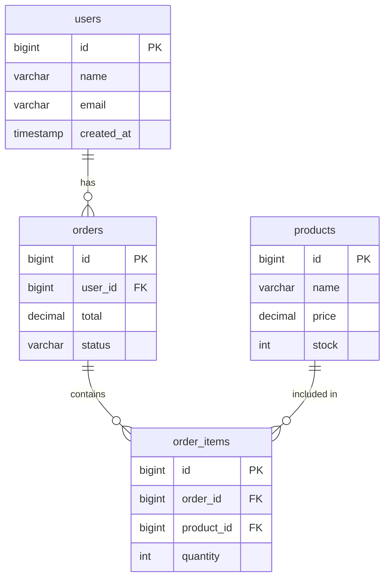

# Tutorial: Building an ER Diagram Editor

In this tutorial, you'll build a database Entity-Relationship (ER) diagram editor. You'll create table nodes with columns, primary/foreign keys, and relationship lines between tables.

## What You'll Build



**Legend:**
- `PK` = Primary Key (shown with key icon)
- `FK` = Foreign Key (shown with link icon)
- `||--o{` = One-to-many relationship (1:N)

## Prerequisites

- Completed the [LangGraph Tutorial](./langgraph-workflow.md) (recommended)
- Fastflow installed (`uv add fastflow`)

---

## Step 1: Create the Basic Application

Create a new file `er_diagram_tutorial.py`:

```python
from fasthtml.common import *
from fastflow import FlowEditor, fastflow_headers

app, rt = fast_app(hdrs=fastflow_headers())

@rt
def index():
    return Titled("ER Diagram Builder",
        FlowEditor(
            id="er-diagram",
        )
    )

serve()
```

Run with `uv run python er_diagram_tutorial.py`.

---

## Step 2: Create Your First Table Node

Instead of generic `Node`, we use the specialized `TableNode` component for ER diagrams:

```python
from fastflow import FlowEditor, TableNode, fastflow_headers

@rt
def index():
    return Titled("ER Diagram Builder",
        FlowEditor(
            # Users table
            TableNode(
                "users",                    # Unique ID
                x=100, y=100,               # Position
                label="users",              # Table name
                columns=[
                    {"name": "id", "type": "bigint", "pk": True},
                    {"name": "name", "type": "varchar(255)"},
                    {"name": "email", "type": "varchar(255)"},
                    {"name": "created_at", "type": "timestamp"},
                ]
            ),
            id="er-diagram",
        )
    )
```

**Column definition:**
- `name`: Column name
- `type`: Data type (displayed in gray)
- `pk`: Set to `True` for primary keys (shows 🔑 icon, blue background)
- `fk`: Set to a reference string for foreign keys (shows 🔗 icon, orange background)

---

## Step 3: Add More Tables

Let's add orders and order_items tables:

```python
@rt
def index():
    return Titled("ER Diagram Builder",
        FlowEditor(
            # Users table
            TableNode("users", x=50, y=50, label="users", columns=[
                {"name": "id", "type": "bigint", "pk": True},
                {"name": "name", "type": "varchar(255)"},
                {"name": "email", "type": "varchar(255)"},
                {"name": "created_at", "type": "timestamp"},
            ]),

            # Orders table
            TableNode("orders", x=400, y=50, label="orders", columns=[
                {"name": "id", "type": "bigint", "pk": True},
                {"name": "user_id", "type": "bigint", "fk": "users.id"},
                {"name": "total", "type": "decimal(10,2)"},
                {"name": "status", "type": "varchar(50)"},
            ]),

            # Order Items table
            TableNode("order_items", x=400, y=280, label="order_items", columns=[
                {"name": "id", "type": "bigint", "pk": True},
                {"name": "order_id", "type": "bigint", "fk": "orders.id"},
                {"name": "product_id", "type": "bigint", "fk": "products.id"},
                {"name": "quantity", "type": "int"},
            ]),

            id="er-diagram",
        )
    )
```

---

## Step 4: Add Relationship Lines

Connect tables with edges using the ER router:

```python
from fastflow import FlowEditor, TableNode, Edge, fastflow_headers

@rt
def index():
    return Titled("ER Diagram Builder",
        FlowEditor(
            # Tables (same as before)
            TableNode("users", x=50, y=50, label="users", columns=[
                {"name": "id", "type": "bigint", "pk": True},
                {"name": "name", "type": "varchar(255)"},
                {"name": "email", "type": "varchar(255)"},
                {"name": "created_at", "type": "timestamp"},
            ]),
            TableNode("orders", x=400, y=50, label="orders", columns=[
                {"name": "id", "type": "bigint", "pk": True},
                {"name": "user_id", "type": "bigint", "fk": "users.id"},
                {"name": "total", "type": "decimal(10,2)"},
                {"name": "status", "type": "varchar(50)"},
            ]),
            TableNode("order_items", x=400, y=280, label="order_items", columns=[
                {"name": "id", "type": "bigint", "pk": True},
                {"name": "order_id", "type": "bigint", "fk": "orders.id"},
                {"name": "product_id", "type": "bigint", "fk": "products.id"},
                {"name": "quantity", "type": "int"},
            ]),

            # Relationship edges
            Edge(
                source="users",
                target="orders",
                relationship="1:N",         # Shows "1:N" label
                router="er",                # ER-style routing
                source_port="port_right",   # Connect from right side
                target_port="port_left",    # Connect to left side
            ),
            Edge(
                source="orders",
                target="order_items",
                relationship="1:N",
                router="er",
                source_port="port_bottom",  # Connect from bottom
                target_port="port_top",     # Connect to top
            ),

            id="er-diagram",
        )
    )
```

**Port positions:**
- `port_top`: Top center of the table
- `port_bottom`: Bottom center
- `port_left`: Left side (middle)
- `port_right`: Right side (middle)

---

## Step 5: Add a Products Table

Complete the diagram with a products table:

```python
# Products table
TableNode("products", x=50, y=280, label="products", columns=[
    {"name": "id", "type": "bigint", "pk": True},
    {"name": "name", "type": "varchar(255)"},
    {"name": "price", "type": "decimal(10,2)"},
    {"name": "stock", "type": "int"},
]),

# Products to Order Items relationship
Edge(
    source="products",
    target="order_items",
    relationship="1:N",
    router="er",
    source_port="port_right",
    target_port="port_left",
),
```

---

## Step 6: Add a Drag-and-Drop Palette

Let users add new tables:

```python
from fastflow import NodePalette, PaletteItem

@rt
def index():
    return Titled("ER Diagram Builder",
        Div(
            # Sidebar
            Aside(
                H3("Tables", style="margin: 0 0 16px 0; font-size: 14px;"),
                P("Drag tables to the canvas. Connect with relationship lines.",
                  style="font-size: 12px; color: #666; margin-bottom: 16px;"),

                NodePalette(
                    PaletteItem(
                        "table",           # Node type
                        "Table",           # Label
                        icon="📊",
                        inputs=1,
                        outputs=1
                    ),
                    target_editor="er-diagram"
                ),

                H4("Tips", style="margin: 20px 0 8px 0; font-size: 12px; color: #64748b;"),
                Div(
                    "• Right-click table → Add/Remove columns",
                    Br(),
                    "• Connect from any side (top, bottom, left, right)",
                    Br(),
                    "• Double-click to rename tables",
                    style="font-size: 11px; color: #64748b; line-height: 1.8; padding: 10px; background: #f8fafc; border-radius: 6px;"
                ),

                style="width: 220px; padding: 16px; background: #fff; border-right: 1px solid #e2e8f0;"
            ),
            # Main editor
            Main(
                FlowEditor(
                    # Tables and edges...
                    id="er-diagram",
                    on_change="/flow/changed",
                ),
                style="flex: 1;"
            ),
            style="display: flex; height: 100vh;"
        )
    )
```

---

## Step 7: Add Dynamic Column Management

Fastflow includes built-in column management via context menu. Users can:

1. **Right-click a table** → "Add Column" or "Remove Column"
2. Fill in column name, type, and whether it's a PK or FK
3. The table automatically resizes

This works automatically with `TableNode` - no additional code needed!

### Programmatic Column Management

You can also manage columns via JavaScript:

```javascript
// Add a column
window.fastflow.addTableColumn('er-diagram', 'users', {
    name: 'phone',
    type: 'varchar(20)',
    pk: false,
    fk: null
});

// Remove a column by index
window.fastflow.removeTableColumn('er-diagram', 'users', 3);

// Get all columns
const columns = window.fastflow.getTableColumns('er-diagram', 'users');

// Replace all columns
window.fastflow.setTableColumns('er-diagram', 'users', [
    {name: 'id', type: 'int', pk: true},
    {name: 'name', type: 'varchar(255)'}
]);
```

---

## Step 8: Handle Events Server-Side

Track changes to your ER diagram:

```python
import json

@rt("/flow/changed")
def post(event: str, data: str, flow: str):
    """Handle ER diagram events."""
    event_data = json.loads(data) if data else {}

    # Log events
    if event == "nodeSelected":
        node_id = event_data.get('id')
        node_data = event_data.get('data', {})
        columns = node_data.get('columns', [])
        print(f"Selected table: {node_id}")
        print(f"Columns: {columns}")

    elif event == "edgeConnected":
        print(f"Relationship: {event_data.get('source')} -> {event_data.get('target')}")

    return ""
```

---

## Step 9: Custom Table Styling

Customize table colors with the `header_fill` and `header_color` parameters:

```python
TableNode("users", x=50, y=50, label="users",
    columns=[
        {"name": "id", "type": "bigint", "pk": True},
        {"name": "name", "type": "varchar(255)"},
    ],
    header_fill="#8b5cf6",      # Purple header
    header_color="#ffffff",     # White text
)

TableNode("orders", x=400, y=50, label="orders",
    columns=[
        {"name": "id", "type": "bigint", "pk": True},
        {"name": "user_id", "type": "bigint", "fk": "users.id"},
    ],
    header_fill="#059669",      # Green header
    header_color="#ffffff",
)
```

---

## Complete Code

Here's the full tutorial code:

```python
from fasthtml.common import *
from fastflow import (
    FlowEditor, TableNode, Edge,
    NodePalette, PaletteItem,
    fastflow_headers
)
import json

app, rt = fast_app(hdrs=fastflow_headers())

@rt
def index():
    return Titled("ER Diagram Builder",
        Div(
            # Sidebar
            Aside(
                H3("Tables", style="margin: 0 0 16px 0; font-size: 14px;"),
                P("Drag tables to the canvas. Connect with relationship lines.",
                  style="font-size: 12px; color: #666; margin-bottom: 12px;"),

                NodePalette(
                    PaletteItem("table", "Table", icon="📊", inputs=1, outputs=1),
                    target_editor="er-diagram"
                ),

                H4("Tips", style="margin: 20px 0 8px 0; font-size: 12px; color: #64748b;"),
                Div(
                    P("• Right-click table → Add/Remove columns", style="margin: 0 0 4px 0; font-size: 11px; color: #64748b;"),
                    P("• Connect from any side (top, bottom, left, right)", style="margin: 0 0 4px 0; font-size: 11px; color: #64748b;"),
                    P("• Double-click to rename tables", style="margin: 0; font-size: 11px; color: #64748b;"),
                    style="padding: 10px; background: #f8fafc; border-radius: 6px; border: 1px solid #e2e8f0;"
                ),

                style="width: 220px; padding: 16px; background: #fff; border-right: 1px solid #e2e8f0;"
            ),
            # Main editor
            Main(
                FlowEditor(
                    # Users table
                    TableNode("users", x=50, y=50, label="users", columns=[
                        {"name": "id", "type": "bigint", "pk": True},
                        {"name": "name", "type": "varchar(255)"},
                        {"name": "email", "type": "varchar(255)"},
                        {"name": "created_at", "type": "timestamp"},
                    ]),

                    # Orders table
                    TableNode("orders", x=400, y=50, label="orders", columns=[
                        {"name": "id", "type": "bigint", "pk": True},
                        {"name": "user_id", "type": "bigint", "fk": "users.id"},
                        {"name": "total", "type": "decimal(10,2)"},
                        {"name": "status", "type": "varchar(50)"},
                    ]),

                    # Products table
                    TableNode("products", x=50, y=280, label="products", columns=[
                        {"name": "id", "type": "bigint", "pk": True},
                        {"name": "name", "type": "varchar(255)"},
                        {"name": "price", "type": "decimal(10,2)"},
                        {"name": "stock", "type": "int"},
                    ]),

                    # Order Items table
                    TableNode("order_items", x=400, y=280, label="order_items", columns=[
                        {"name": "id", "type": "bigint", "pk": True},
                        {"name": "order_id", "type": "bigint", "fk": "orders.id"},
                        {"name": "product_id", "type": "bigint", "fk": "products.id"},
                        {"name": "quantity", "type": "int"},
                    ]),

                    # Relationships
                    Edge(source="users", target="orders", relationship="1:N", router="er",
                         source_port="port_right", target_port="port_left"),
                    Edge(source="orders", target="order_items", relationship="1:N", router="er",
                         source_port="port_bottom", target_port="port_top"),
                    Edge(source="products", target="order_items", relationship="1:N", router="er",
                         source_port="port_right", target_port="port_left"),

                    id="er-diagram",
                    on_change="/flow/changed",
                ),
                style="flex: 1;"
            ),
            style="display: flex; height: 100vh;"
        )
    )

@rt("/flow/changed")
def post(event: str, data: str, flow: str):
    """Handle ER diagram events."""
    event_data = json.loads(data) if data else {}
    print(f"ER Event: {event}")
    print(f"Data: {event_data}")
    return ""

serve()
```

---

## Visual Features

Your `TableNode` components include these visual features:

| Feature | Description |
|---------|-------------|
| **Gradient header** | Blue gradient background on table name |
| **Gradient body** | Subtle white-to-gray gradient |
| **Drop shadow** | Soft shadow for depth |
| **PK highlighting** | Light blue background for primary keys |
| **FK highlighting** | Light orange background for foreign keys |
| **Hidden ports** | Port circles appear only on hover |
| **Port hover effect** | Ports enlarge and highlight when hovering |

---

## What You Learned

1. **TableNode component** for creating table entities
2. **Column definitions** with pk/fk indicators
3. **Four-way port connections** (top, bottom, left, right)
4. **Relationship edges** with `relationship="1:N"` labels
5. **ER router** for clean right-angle lines
6. **Dynamic column management** via context menu
7. **JavaScript API** for programmatic column updates

---

## Next Steps

- Add **indexes** and **constraints** display
- Implement **schema export** to SQL DDL
- Add **reverse engineering** from existing database
- Support **many-to-many** relationships with junction tables

Continue to the next tutorial: [Data Processing DAG](./data-processing-dag.md)
