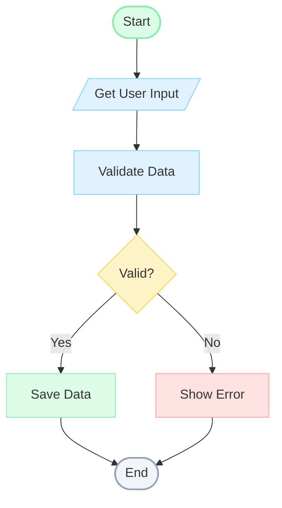

# Tutorial: Building a Traditional Flowchart Editor

In this tutorial, you'll build a classic flowchart editor with standard shapes: rounded rectangles for start/end, rectangles for processes, diamonds for decisions, and parallelograms for data I/O.

## What You'll Build



**Standard Flowchart Shapes:**
- `([...])` = Rounded rectangle (Start/End terminators)
- `[...]` = Rectangle (Process steps)
- `{...}` = Diamond (Decision points)
- `[/.../]` = Parallelogram (Data I/O)

## Prerequisites

- Completed the [LangGraph Tutorial](./langgraph-workflow.md)
- Fastflow installed

---

## Step 1: Create the Base Application

Create `flowchart_tutorial.py`:

```python
from fasthtml.common import *
from fastflow import FlowEditor, fastflow_headers

app, rt = fast_app(hdrs=fastflow_headers())

@rt
def index():
    return Titled("Flowchart Editor",
        FlowEditor(
            id="flowchart",
        )
    )

serve()
```

---

## Step 2: Use FlowchartNode for Standard Shapes

The `FlowchartNode` component provides classic flowchart shapes:

```python
from fastflow import FlowEditor, FlowchartNode, fastflow_headers

@rt
def index():
    return Titled("Flowchart Editor",
        FlowEditor(
            # Start node - rounded terminator
            FlowchartNode(
                "start",
                x=200, y=50,
                label="Start",
                node_type="start",    # Rounded rectangle
            ),
            id="flowchart",
        )
    )
```

**Available FlowchartNode types:**
- `start` - Rounded rectangle (green) - Flow beginning
- `end` - Rounded rectangle (gray) - Flow termination
- `process` - Rectangle (blue) - Processing step
- `decision` - Diamond shape (orange) - Yes/No branch
- `data` - Parallelogram (cyan) - Data I/O
- `connector` - Circle (gray) - Flow connector

---

## Step 3: Build the Start and Input

```python
@rt
def index():
    return Titled("Flowchart Editor",
        FlowEditor(
            # Start
            FlowchartNode("start", x=200, y=50, label="Start",
                         node_type="start",
                         inputs=0, outputs=1),

            # Data input
            FlowchartNode("input", x=200, y=150, label="Get User Input",
                         node_type="data"),

            id="flowchart",
        )
    )
```

---

## Step 4: Add Process and Decision Nodes

```python
# Process step
FlowchartNode("process", x=200, y=250, label="Validate Data",
             node_type="process"),

# Decision diamond
FlowchartNode("decision", x=200, y=370, label="Valid?",
             node_type="decision",
             outputs=2),  # Yes and No branches
```

The `decision` node type creates a diamond shape with two outputs for branching.

---

## Step 5: Add Output Branches

```python
# Success output
FlowchartNode("success", x=80, y=500, label="Save Data",
             node_type="process"),

# Error output
FlowchartNode("error", x=320, y=500, label="Show Error",
             node_type="process"),
```

---

## Step 6: Add End Node

```python
# End
FlowchartNode("end", x=200, y=620, label="End",
             node_type="end",
             inputs=2, outputs=0),  # Receives from both branches
```

---

## Step 7: Connect with Edges

```python
from fastflow import FlowEditor, FlowchartNode, Edge, fastflow_headers

# Main flow
Edge(source="start", target="input"),
Edge(source="input", target="process"),
Edge(source="process", target="decision"),

# Decision branches
Edge(source="decision", target="success",
     label="Yes",
     source_port=0),
Edge(source="decision", target="error",
     label="No",
     source_port=1),

# Converge to end
Edge(source="success", target="end", target_port=0),
Edge(source="error", target="end", target_port=1),
```

---

## Step 8: Add a Flowchart Palette

```python
from fastflow import NodePalette, PaletteItem, PaletteGroup

@rt
def index():
    return Titled("Flowchart Editor",
        Div(
            # Sidebar
            Aside(
                H3("Flowchart", style="margin: 0 0 16px 0; font-size: 14px;"),
                P("Create flowcharts with standard shapes.",
                  style="font-size: 12px; color: #666; margin-bottom: 16px;"),

                NodePalette(
                    PaletteGroup(
                        PaletteItem("start", "START", inputs=0, outputs=1),
                        PaletteItem("end", "END", inputs=1, outputs=0),
                        title="Terminators"
                    ),
                    PaletteGroup(
                        PaletteItem("process", "PROCESS", inputs=1, outputs=1),
                        PaletteItem("decision", "DECISION", inputs=1, outputs=2),
                        title="Operations"
                    ),
                    PaletteGroup(
                        PaletteItem("data", "DATA", inputs=1, outputs=1),
                        PaletteItem("connector", "CONNECTOR", inputs=1, outputs=1),
                        title="I/O & Connectors"
                    ),
                    target_editor="flowchart"
                ),

                H4("Shape Legend", style="margin: 20px 0 8px 0; font-size: 12px; color: #64748b;"),
                Div(
                    P("╭──╮ Rounded - Start/End", style="margin: 2px 0; font-size: 11px;"),
                    P("┌──┐ Rectangle - Process", style="margin: 2px 0; font-size: 11px;"),
                    P("◇ Diamond - Decision", style="margin: 2px 0; font-size: 11px;"),
                    P("▱ Parallelogram - Data I/O", style="margin: 2px 0; font-size: 11px;"),
                    P("○ Circle - Connector", style="margin: 2px 0; font-size: 11px;"),
                    style="padding: 10px; background: #f8fafc; border-radius: 6px; color: #64748b;"
                ),

                H4("Tips", style="margin: 20px 0 8px 0; font-size: 12px; color: #64748b;"),
                Div(
                    P("• Double-click to rename", style="margin: 2px 0; font-size: 11px;"),
                    P("• Click ports to connect", style="margin: 2px 0; font-size: 11px;"),
                    P("• Press Delete to remove", style="margin: 2px 0; font-size: 11px;"),
                    style="padding: 10px; background: #f8fafc; border-radius: 6px; color: #64748b;"
                ),

                style="width: 220px; padding: 16px; background: #fff; border-right: 1px solid #e2e8f0;"
            ),
            # Main editor
            Main(
                FlowEditor(
                    # ... nodes and edges ...
                    id="flowchart",
                    on_change="/flow/changed",
                ),
                style="flex: 1;"
            ),
            style="display: flex; height: 100vh;"
        )
    )
```

---

## Step 9: Add a Loop Back

Flowcharts often have loops. Let's add one for invalid input:

```python
# Modify the error node to loop back
FlowchartNode("error", x=320, y=500, label="Show Error",
             node_type="process",
             outputs=1),  # Now has an output

# Add connector for the loop
FlowchartNode("loop_connector", x=420, y=250, label="",
             node_type="connector",
             inputs=1, outputs=1),

# Update edges
Edge(source="error", target="loop_connector"),
Edge(source="loop_connector", target="process", dashed=True),  # Loop back
```

---

## Complete Code

```python
from fasthtml.common import *
from fastflow import (
    FlowEditor, FlowchartNode, Edge,
    NodePalette, PaletteItem, PaletteGroup,
    fastflow_headers
)
import json

app, rt = fast_app(hdrs=fastflow_headers())

@rt
def index():
    return Titled("Flowchart Editor",
        Div(
            # Sidebar
            Aside(
                H3("Flowchart", style="margin: 0 0 16px 0; font-size: 14px;"),
                P("Create flowcharts with standard shapes.",
                  style="font-size: 12px; color: #666; margin-bottom: 16px;"),

                NodePalette(
                    PaletteGroup(
                        PaletteItem("start", "START", inputs=0, outputs=1),
                        PaletteItem("end", "END", inputs=1, outputs=0),
                        title="Terminators"
                    ),
                    PaletteGroup(
                        PaletteItem("process", "PROCESS", inputs=1, outputs=1),
                        PaletteItem("decision", "DECISION", inputs=1, outputs=2),
                        title="Operations"
                    ),
                    PaletteGroup(
                        PaletteItem("data", "DATA", inputs=1, outputs=1),
                        PaletteItem("connector", "CONNECTOR", inputs=1, outputs=1),
                        title="I/O & Connectors"
                    ),
                    target_editor="flowchart"
                ),

                H4("Shape Legend", style="margin: 20px 0 8px 0; font-size: 12px; color: #64748b;"),
                Div(
                    P("╭──╮ Rounded - Start/End", style="margin: 2px 0; font-size: 11px;"),
                    P("┌──┐ Rectangle - Process", style="margin: 2px 0; font-size: 11px;"),
                    P("◇ Diamond - Decision", style="margin: 2px 0; font-size: 11px;"),
                    P("▱ Parallelogram - Data I/O", style="margin: 2px 0; font-size: 11px;"),
                    P("○ Circle - Connector", style="margin: 2px 0; font-size: 11px;"),
                    style="padding: 10px; background: #f8fafc; border-radius: 6px; color: #64748b;"
                ),

                style="width: 220px; padding: 16px; background: #fff; border-right: 1px solid #e2e8f0;"
            ),
            # Main editor
            Main(
                FlowEditor(
                    # Start
                    FlowchartNode("start", x=200, y=50, label="Start",
                                 node_type="start", inputs=0, outputs=1),

                    # Input
                    FlowchartNode("input", x=200, y=150, label="Get User Input",
                                 node_type="data"),

                    # Process
                    FlowchartNode("process", x=200, y=250, label="Validate Data",
                                 node_type="process"),

                    # Decision
                    FlowchartNode("decision", x=200, y=370, label="Valid?",
                                 node_type="decision", outputs=2),

                    # Success path
                    FlowchartNode("success", x=80, y=500, label="Save Data",
                                 node_type="process"),

                    # Error path
                    FlowchartNode("error", x=320, y=500, label="Show Error",
                                 node_type="process"),

                    # End
                    FlowchartNode("end", x=200, y=620, label="End",
                                 node_type="end", inputs=2, outputs=0),

                    # Edges - Main flow
                    Edge(source="start", target="input"),
                    Edge(source="input", target="process"),
                    Edge(source="process", target="decision"),

                    # Edges - Decision branches
                    Edge(source="decision", target="success", label="Yes", source_port=0),
                    Edge(source="decision", target="error", label="No", source_port=1),

                    # Edges - Converge to end
                    Edge(source="success", target="end", target_port=0),
                    Edge(source="error", target="end", target_port=1),

                    id="flowchart",
                    on_change="/flow/changed",
                ),
                style="flex: 1;"
            ),
            style="display: flex; height: 100vh;"
        )
    )

@rt("/flow/changed")
def post(event: str, data: str, flow: str):
    event_data = json.loads(data) if data else {}
    print(f"Flowchart Event: {event}, Data: {event_data}")
    return ""

serve()
```

---

## What You Learned

1. **FlowchartNode component** with standard flowchart shapes
2. **Shape types**: start, end, process, decision, data, connector
3. **Decision nodes** with Yes/No branching
4. **Multiple inputs** for converging flows
5. **Grouped palette** for organized node types
6. **Connectors** for complex flow routing

---

## Standard Flowchart Symbols

| Symbol | Node Type | Purpose |
|--------|-----------|---------|
| Rounded Rectangle | `start`, `end` | Terminal points |
| Rectangle | `process` | Processing step |
| Diamond | `decision` | Yes/No decision |
| Parallelogram | `data` | Data input/output |
| Circle | `connector` | Flow connector/junction |

---

## Flowchart Best Practices

1. **Single start, single end** - Keep flows simple
2. **Top-to-bottom, left-to-right** - Standard reading direction
3. **Decision labels** - Always label Yes/No branches
4. **Minimize crossings** - Use connectors to avoid line crossings
5. **Consistent spacing** - Keep nodes evenly spaced

---

## Next Steps

- Add **swimlanes** for multi-actor processes
- Implement **nested subprocesses** (expand/collapse)
- Add **annotations** and comments
- Export to **BPMN** or **Visio** formats

---

## Congratulations!

You've completed all six Fastflow tutorials! You now know how to build:

1. ✅ [LangGraph-style workflows](./langgraph-workflow.md)
2. ✅ [ER diagram editors](./er-diagram.md)
3. ✅ [Data processing DAGs](./data-processing-dag.md)
4. ✅ [ML training pipelines](./ai-model-dag.md)
5. ✅ [Agent orchestration flows](./agent-flow.md)
6. ✅ [Traditional flowcharts](./flowchart.md)

## What's Next?

- Check out the complete example in `examples/basic/app.py`
- Read the [Architecture Guide](../how_it_works/architecture.md)
- Explore the [API Reference](../../README.md#api-reference)
- Build your own custom workflow editor!
