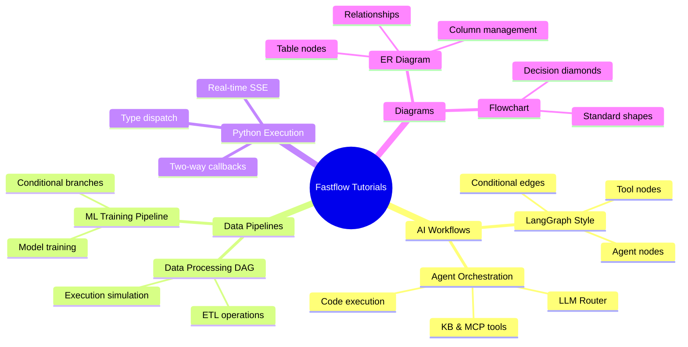

# Fastflow Tutorials

Step-by-step guides for building different types of visual workflow editors with Fastflow.

## Tutorial Overview



## Prerequisites

Before starting these tutorials, make sure you have:

1. **Python 3.10+** installed
2. **uv** package manager (recommended) or pip
3. Basic familiarity with [FastHTML](https://fastht.ml/)

```bash
# Install fastflow
uv add fastflow

# Or with pip
pip install fastflow
```

## Available Tutorials

### 1. [LangGraph-Style Workflow](./langgraph-workflow.md)

Build an AI agent workflow editor like LangGraph Builder with:
- Start and end nodes
- Agent and tool nodes
- Conditional edges with labels
- Interactive node selection

**Difficulty**: Beginner
**Time**: 15 minutes

---

### 2. [ER Diagram Builder](./er-diagram.md)

Create a database entity-relationship diagram editor with:
- Table nodes with columns
- Primary and foreign key indicators
- Relationship lines (1:1, 1:N, N:N)
- Dynamic column management

**Difficulty**: Intermediate
**Time**: 25 minutes

---

### 3. [Data Processing DAG](./data-processing-dag.md)

Build a data pipeline visualization tool with:
- Input/output nodes
- Filter, join, and aggregate operations
- Left-to-right horizontal flow
- Execution simulation with animations

**Difficulty**: Intermediate
**Time**: 30 minutes

---

### 4. [AI/ML Training Pipeline](./ai-model-dag.md)

Create an ML training pipeline editor with:
- Data preparation stages
- Model training nodes
- Conditional branches (pass/fail)
- Real-time status indicators

**Difficulty**: Intermediate
**Time**: 25 minutes

---

### 5. [Agent Orchestration Flow](./agent-flow.md)

Build a complex agent orchestration system with:
- LLM router nodes
- Code execution nodes
- Knowledge base and MCP tools
- Database operations

**Difficulty**: Advanced
**Time**: 35 minutes

---

### 6. [Traditional Flowchart](./flowchart.md)

Create a classic flowchart editor with:
- Process and decision nodes
- Diamond shapes for conditionals
- Data I/O parallelograms
- Standard flowchart styling

**Difficulty**: Beginner
**Time**: 20 minutes

---

### 7. [Python Execution with SSE](./python-execution.md)

Build a Python-driven pipeline with real-time visual updates:
- Type-dispatched nodes (InputNode, FilterNode, etc.)
- Async handler functions for actual work
- FlowExecutor with dependency ordering
- Two-way callback system (fastai-style)
- Real-time SSE streaming to browser

**Difficulty**: Intermediate
**Time**: 30 minutes

---

## Tutorial Structure

Each tutorial follows this structure:

1. **Overview** - What you'll build
2. **Setup** - Creating the base application
3. **Step-by-Step** - Incremental building of features
4. **Enhancements** - Adding interactivity
5. **Complete Code** - Full working example
6. **Next Steps** - Ideas for extending

## Quick Reference

### Common Imports

```python
from fasthtml.common import *
from fastflow import (
    FlowEditor, Node, Edge,
    NodePalette, PaletteItem, PaletteGroup,
    FlowControls, fastflow_headers,
    # Specialized components
    TableNode, DAGNode, AgentNode, FlowchartNode,
    StatusBadge,
)
```

### Basic App Template

```python
from fasthtml.common import *
from fastflow import FlowEditor, Node, Edge, fastflow_headers

app, rt = fast_app(hdrs=fastflow_headers())

@rt
def index():
    return Titled("My Flow Editor",
        FlowEditor(
            # Add nodes and edges here
            id="my-flow",
            on_change="/flow/changed",
        )
    )

@rt("/flow/changed")
def post(event: str, data: str, flow: str):
    import json
    print(f"Event: {event}")
    return ""

serve()
```

## Related Documentation

For deeper dives into specific topics:

- [Python Execution Deep Dive](../how_it_works/python_execution.md) - Advanced callback API, error handling, control flow exceptions
- [Architecture Guide](../how_it_works/architecture.md) - Overall Fastflow architecture and design

---

## Getting Help

- Check the [API Reference](../../README.md#api-reference)
- Read the [Architecture Guide](../how_it_works/architecture.md)
- See complete examples in the `examples/` directory
