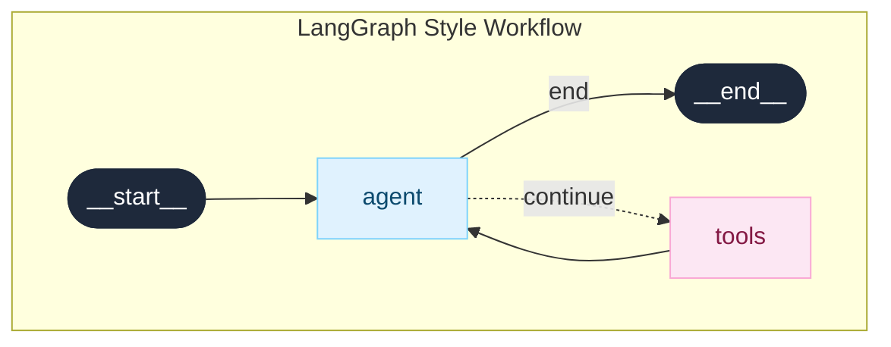

# Tutorial: Building a LangGraph-Style Workflow Editor

In this tutorial, you'll build an AI agent workflow editor inspired by [LangGraph Builder](https://langchain-ai.github.io/langgraph/). By the end, you'll have an interactive visual editor for designing agent workflows.

## What You'll Build



**Legend:**
- Rounded nodes = Start/End (pill-shaped, dark)
- Blue node = Agent
- Pink node = Tools
- Dashed line = Conditional edge

## Prerequisites

- Python 3.10+
- `uv` package manager
- Fastflow installed (`uv add fastflow`)

---

## Step 1: Create the Basic Application

Create a new file `langgraph_tutorial.py`:

```python
from fasthtml.common import *
from fastflow import FlowEditor, Node, Edge, fastflow_headers

# Create app with Fastflow headers (loads X6 library)
app, rt = fast_app(hdrs=fastflow_headers())

@rt
def index():
    return Titled("LangGraph Workflow Builder",
        FlowEditor(
            id="langgraph-flow",
        )
    )

serve()
```

Run it with `uv run python langgraph_tutorial.py` and open http://localhost:5001. You'll see an empty canvas with a grid background.

---

## Step 2: Add the Start Node

LangGraph workflows begin with a `__start__` node. Add it to the FlowEditor:

```python
@rt
def index():
    return Titled("LangGraph Workflow Builder",
        FlowEditor(
            # Start node - pill-shaped, dark background
            Node("__start__",
                 x=300, y=50,           # Position on canvas
                 label="__start__",      # Display text
                 node_type="start",      # Use "start" styling
                 inputs=0,               # No input ports
                 outputs=1),             # One output port
            id="langgraph-flow",
        )
    )
```

**Key points:**
- `node_type="start"` applies LangGraph-style pill shape with dark background
- `inputs=0` means nothing connects into this node
- `outputs=1` creates one output port at the bottom

---

## Step 3: Add the Agent Node

Now add an agent node that processes user requests:

```python
@rt
def index():
    return Titled("LangGraph Workflow Builder",
        FlowEditor(
            # Start node
            Node("__start__", x=300, y=50, label="__start__",
                 node_type="start", inputs=0, outputs=1),

            # Agent node - light blue background
            Node("agent",
                 x=300, y=180,
                 label="agent",
                 node_type="agent",      # Blue styling
                 inputs=1,               # One input from start
                 outputs=2),             # Two outputs: tools and end

            id="langgraph-flow",
        )
    )
```

The `node_type="agent"` gives it a light blue background like LangGraph Builder.

---

## Step 4: Add Tools and End Nodes

Complete the workflow with tools and end nodes:

```python
@rt
def index():
    return Titled("LangGraph Workflow Builder",
        FlowEditor(
            # Start node
            Node("__start__", x=300, y=50, label="__start__",
                 node_type="start", inputs=0, outputs=1),

            # Agent node
            Node("agent", x=300, y=180, label="agent",
                 node_type="agent", inputs=1, outputs=2),

            # Tools node - pink background
            Node("tools",
                 x=500, y=180,          # Positioned to the right
                 label="tools",
                 node_type="tool",       # Pink styling
                 inputs=1, outputs=1),

            # End node
            Node("__end__",
                 x=300, y=310,
                 label="__end__",
                 node_type="end",        # Pill-shaped, dark
                 inputs=1, outputs=0),

            id="langgraph-flow",
        )
    )
```

---

## Step 5: Connect Nodes with Edges

Now wire the nodes together with edges:

```python
@rt
def index():
    return Titled("LangGraph Workflow Builder",
        FlowEditor(
            # Nodes (same as before)
            Node("__start__", x=300, y=50, label="__start__",
                 node_type="start", inputs=0, outputs=1),
            Node("agent", x=300, y=180, label="agent",
                 node_type="agent", inputs=1, outputs=2),
            Node("tools", x=500, y=180, label="tools",
                 node_type="tool", inputs=1, outputs=1),
            Node("__end__", x=300, y=310, label="__end__",
                 node_type="end", inputs=1, outputs=0),

            # Edges
            Edge(source="__start__", target="agent"),
            Edge(source="agent", target="__end__", label="end"),
            Edge(source="agent", target="tools", label="continue"),
            Edge(source="tools", target="agent"),  # Loop back

            id="langgraph-flow",
        )
    )
```

**Edge features:**
- `label="end"` adds a pill-shaped label badge on the edge
- Edges are drawn as smooth curves by default

---

## Step 6: Add Conditional (Dashed) Edges

In LangGraph, conditional edges are shown with dashed lines. Update the edges:

```python
# Edges with conditional styling
Edge(source="__start__", target="agent"),
Edge(source="agent", target="__end__",
     label="end",
     source_port=0),            # First output port
Edge(source="agent", target="tools",
     label="continue",
     dashed=True,               # Dashed line for conditional
     source_port=1),            # Second output port
Edge(source="tools", target="agent"),
```

The `dashed=True` parameter creates a dashed line indicating a conditional branch.

---

## Step 7: Add a Node Palette for Drag-and-Drop

Let users add new nodes by dragging from a palette:

```python
from fastflow import NodePalette, PaletteItem

@rt
def index():
    return Titled("LangGraph Workflow Builder",
        Div(
            # Sidebar with palette
            Aside(
                H3("Add Nodes", style="margin: 0 0 16px 0;"),
                NodePalette(
                    PaletteItem("agent", "Agent", icon="🤖",
                               inputs=1, outputs=2),
                    PaletteItem("tool", "Tool", icon="🔧",
                               inputs=1, outputs=1),
                    PaletteItem("llm", "LLM", icon="🧠",
                               inputs=1, outputs=1),
                    PaletteItem("condition", "Condition", icon="❓",
                               inputs=1, outputs=2),
                    target_editor="langgraph-flow"
                ),
                style="width: 200px; padding: 16px; background: #f8fafc;"
            ),
            # Main editor
            Main(
                FlowEditor(
                    # ... nodes and edges ...
                    id="langgraph-flow",
                ),
                style="flex: 1;"
            ),
            style="display: flex; height: 100vh;"
        )
    )
```

Users can now drag items from the palette onto the canvas!

---

## Step 8: Handle Flow Changes with HTMX

Add server-side event handling:

```python
import json

@rt
def index():
    return Titled("LangGraph Workflow Builder",
        Div(
            Aside(
                H3("Add Nodes"),
                NodePalette(
                    PaletteItem("agent", "Agent", icon="🤖", inputs=1, outputs=2),
                    PaletteItem("tool", "Tool", icon="🔧", inputs=1, outputs=1),
                    target_editor="langgraph-flow"
                ),
                Div(id="status", style="margin-top: 20px; font-size: 12px;"),
                style="width: 200px; padding: 16px;"
            ),
            Main(
                FlowEditor(
                    # ... nodes and edges ...
                    id="langgraph-flow",
                    on_change="/flow/changed",  # HTMX endpoint
                ),
                style="flex: 1;"
            ),
            style="display: flex; height: 100vh;"
        )
    )

@rt("/flow/changed")
def post(event: str, data: str, flow: str):
    """Handle flow change events."""
    event_data = json.loads(data) if data else {}

    # Log the event
    print(f"Event: {event}")
    print(f"Data: {event_data}")

    # Return status update
    messages = {
        "nodeSelected": f"Selected: {event_data.get('id', 'unknown')}",
        "edgeConnected": "Edge connected!",
        "nodeAdded": f"Added node: {event_data.get('id', 'new')}",
        "nodeRemoved": "Node removed",
    }

    return Div(
        messages.get(event, f"Event: {event}"),
        id="status",
        style="color: #22c55e;"
    )
```

Now you'll see status updates in the sidebar as you interact with the flow!

---

## Step 9: Add Zoom Controls

Add buttons to control the view:

```python
from fastflow import FlowControls

Main(
    FlowEditor(
        # ... nodes and edges ...
        id="langgraph-flow",
        on_change="/flow/changed",
    ),
    FlowControls(target_editor="langgraph-flow"),  # Zoom buttons
    style="flex: 1; position: relative;"
)
```

This adds zoom in/out and fit-to-screen buttons in the bottom-right corner.

---

## Complete Code

Here's the full tutorial code:

```python
from fasthtml.common import *
from fastflow import (
    FlowEditor, Node, Edge,
    NodePalette, PaletteItem, FlowControls,
    fastflow_headers
)
import json

app, rt = fast_app(hdrs=fastflow_headers())

@rt
def index():
    return Titled("LangGraph Workflow Builder",
        Div(
            # Sidebar
            Aside(
                H3("Add Nodes", style="margin: 0 0 16px 0; font-size: 14px;"),
                NodePalette(
                    PaletteItem("agent", "Agent", icon="🤖", inputs=1, outputs=2),
                    PaletteItem("tool", "Tool", icon="🔧", inputs=1, outputs=1),
                    PaletteItem("llm", "LLM", icon="🧠", inputs=1, outputs=1),
                    PaletteItem("condition", "Condition", icon="❓", inputs=1, outputs=2),
                    target_editor="langgraph-flow"
                ),
                H4("Tips", style="margin: 20px 0 8px 0; font-size: 12px; color: #64748b;"),
                Div(
                    "• Drag nodes from palette to canvas",
                    Br(),
                    "• Click ports to connect nodes",
                    Br(),
                    "• Double-click to rename",
                    Br(),
                    "• Press Delete to remove",
                    style="font-size: 11px; color: #64748b; line-height: 1.8;"
                ),
                Div(id="status", style="margin-top: 20px;"),
                style="width: 200px; padding: 16px; background: #f8fafc; border-right: 1px solid #e2e8f0;"
            ),
            # Main editor
            Main(
                FlowEditor(
                    # Start node
                    Node("__start__", x=300, y=50, label="__start__",
                         node_type="start", inputs=0, outputs=1),
                    # Agent node
                    Node("agent", x=300, y=180, label="agent",
                         node_type="agent", inputs=1, outputs=2),
                    # Tools node
                    Node("tools", x=500, y=180, label="tools",
                         node_type="tool", inputs=1, outputs=1),
                    # End node
                    Node("__end__", x=300, y=310, label="__end__",
                         node_type="end", inputs=1, outputs=0),
                    # Edges
                    Edge(source="__start__", target="agent"),
                    Edge(source="agent", target="__end__", label="end", source_port=0),
                    Edge(source="agent", target="tools", label="continue",
                         dashed=True, source_port=1),
                    Edge(source="tools", target="agent"),
                    id="langgraph-flow",
                    on_change="/flow/changed",
                ),
                FlowControls(target_editor="langgraph-flow"),
                style="flex: 1; position: relative;"
            ),
            style="display: flex; height: 100vh;"
        )
    )

@rt("/flow/changed")
def post(event: str, data: str, flow: str):
    """Handle flow change events."""
    event_data = json.loads(data) if data else {}
    print(f"Event: {event}, Data: {event_data}")

    messages = {
        "nodeSelected": f"Selected: {event_data.get('id', 'unknown')}",
        "edgeConnected": "Edge connected!",
        "nodeAdded": f"Added: {event_data.get('id', 'new')}",
        "nodeRemoved": "Node removed",
        "change": f"Changed: {event_data.get('type', 'unknown')}",
    }

    return Div(
        messages.get(event, f"{event}"),
        id="status",
        style="font-size: 12px; color: #22c55e; padding: 8px; background: #f0fdf4; border-radius: 4px;"
    )

serve()
```

---

## What You Learned

1. **Creating nodes** with different `node_type` styles (start, end, agent, tool)
2. **Connecting nodes** with edges and optional labels
3. **Conditional edges** using `dashed=True`
4. **Multiple output ports** with `source_port` parameter
5. **Drag-and-drop palette** for adding new nodes
6. **HTMX event handling** for server-side logic
7. **Zoom controls** for better canvas navigation

---

## Next Steps

- Add an **LLM node** to call AI models
- Implement **conditional routing** based on agent output
- **Save/load workflows** to a database
- Add **custom node types** using typed node classes from `fastflow.types`

Continue to the next tutorial: [ER Diagram Builder](./er-diagram.md)
