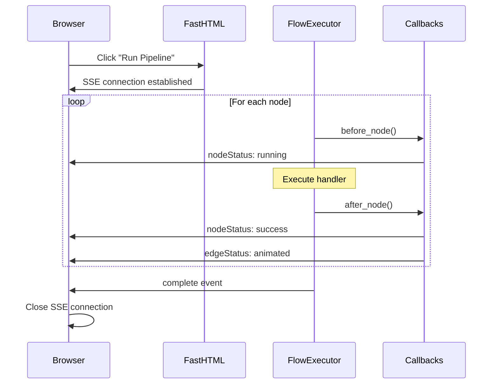

# Tutorial: Python-Based Flow Execution with SSE

In this tutorial, you'll build a data pipeline that executes entirely in Python with real-time visual feedback via Server-Sent Events (SSE). This is the foundation for building agent systems, ML pipelines, or n8n-like workflow engines.

## What You'll Build



**Features:**
- Type-dispatched nodes (InputNode, FilterNode, etc.)
- Two-way callback system (fastai-style)
- Real-time SSE updates to browser
- Custom async handler functions

## Prerequisites

- Python 3.10+
- `uv` package manager
- Fastflow installed (`uv add fastflow`)

---

## Step 1: Create the Basic Application

Create a new file `python_exec_tutorial.py`:

```python
from fasthtml.common import *
from fastflow import FlowEditor, DAGNode, Edge, fastflow_headers

app, rt = fast_app(hdrs=fastflow_headers())

@rt
def index():
    return Titled("Python Execution Demo",
        FlowEditor(
            # Visual nodes (for display)
            DAGNode("load", x=100, y=100, label="Load Data",
                   node_type="input", icon="📥", inputs=0, outputs=1,
                   port_positions={"inputs": "left", "outputs": "right"}),
            DAGNode("process", x=350, y=100, label="Process",
                   node_type="transform", icon="🔄",
                   port_positions={"inputs": "left", "outputs": "right"}),
            DAGNode("save", x=600, y=100, label="Save",
                   node_type="output", icon="💾", inputs=1, outputs=0,
                   port_positions={"inputs": "left", "outputs": "right"}),
            # Edges
            Edge(source="load", target="process", color="#94a3b8"),
            Edge(source="process", target="save", color="#94a3b8"),
            id="my-pipeline",
        ),
        Button("▶ Run Pipeline", onclick="runPipeline()",
               style="margin: 20px; padding: 10px 20px; background: #10b981; color: white; border: none; border-radius: 6px; cursor: pointer;"),
        Div(id="results", style="margin: 20px; font-family: monospace;"),
    )

serve()
```

Run it with `uv run python python_exec_tutorial.py`. You'll see a simple 3-node pipeline.

---

## Step 2: Create Typed Nodes

Fastflow provides typed node classes that enable type dispatch. Import and define your execution nodes:

```python
from fastflow.types import InputNode, TransformNode, OutputNode

# Define typed nodes (separate from visual DAGNodes)
load_node = InputNode(id="load", label="Load Data", source="database")
process_node = TransformNode(id="process", label="Process", transform_type="normalize")
save_node = OutputNode(id="save", label="Save", destination="file")
```

Typed nodes carry metadata and enable type-dispatched operations like `execute()`, `validate()`, and `render()`.

---

## Step 3: Create Handler Functions

Each node needs an async handler function that performs the actual work:

```python
import asyncio

async def load_handler(context: dict, inputs: dict) -> dict:
    """Load data from the source."""
    await asyncio.sleep(1.0)  # Simulate I/O
    return {"records": 500, "source": "users_table"}

async def process_handler(context: dict, inputs: dict) -> dict:
    """Process the loaded data."""
    await asyncio.sleep(0.8)
    # Access results from upstream nodes via inputs dict
    load_result = inputs.get("load", {})
    records = load_result.get("records", 0)
    return {"records": records, "processed": True}

async def save_handler(context: dict, inputs: dict) -> dict:
    """Save the processed data."""
    await asyncio.sleep(0.5)
    process_result = inputs.get("process", {})
    return {"saved": process_result.get("records", 0), "status": "success"}
```

**Handler signature:**
- `context`: Shared dict for database connections, configs, etc.
- `inputs`: Dict mapping dependency node IDs to their results
- Returns: Any JSON-serializable value passed to dependent nodes

---

## Step 4: Create the FlowExecutor

The `FlowExecutor` orchestrates execution with topological ordering:

```python
from fastflow.execution import FlowExecutor, ExecutionStep

executor = FlowExecutor(
    graph_id="my-pipeline",
    steps=[
        ExecutionStep(
            node_id="load",
            node=load_node,
            depends_on=[],
            handler=load_handler
        ),
        ExecutionStep(
            node_id="process",
            node=process_node,
            depends_on=["load"],
            handler=process_handler
        ),
        ExecutionStep(
            node_id="save",
            node=save_node,
            depends_on=["process"],
            handler=save_handler
        ),
    ]
)
```

**Key points:**
- `graph_id` must match the FlowEditor's `id`
- `depends_on` defines the execution order (DAG)
- The executor handles topological sorting automatically

---

## Step 5: Create the SSE Endpoint

Add an endpoint that streams execution events to the browser:

```python
@rt("/execute/pipeline")
async def get():
    """SSE endpoint for pipeline execution."""
    async def event_generator():
        async for msg in executor.run():
            yield msg

    return EventStream(event_generator())
```

The `executor.run()` yields SSE messages for:
- `nodeStatus`: Node state changes (pending → running → success/error)
- `edgeStatus`: Edge animations during data flow
- `complete`: Final results when execution finishes
- `error`: Error information if something fails

---

## Step 6: Connect the Frontend

Add JavaScript to connect to the SSE endpoint and update the graph:

```python
EXECUTION_SCRIPT = Script("""
    let eventSource = null;

    function runPipeline() {
        const graph = window.fastflow?.['my-pipeline'];
        if (!graph) return;

        document.getElementById('results').innerHTML = 'Starting...';

        // Connect to SSE endpoint
        eventSource = new EventSource('/execute/pipeline');

        // Handle node status updates
        eventSource.addEventListener('nodeStatus', function(e) {
            const data = JSON.parse(e.data);
            updateNodeStatus(graph, data.nodeId, data.status);
            document.getElementById('results').innerHTML +=
                `<div>Node ${data.nodeId}: ${data.status}</div>`;
        });

        // Handle edge animations
        eventSource.addEventListener('edgeStatus', function(e) {
            const data = JSON.parse(e.data);
            updateEdgeStatus(graph, data.sourceId, data.targetId, data.animated);
        });

        // Handle completion
        eventSource.addEventListener('complete', function(e) {
            const data = JSON.parse(e.data);
            document.getElementById('results').innerHTML +=
                `<div style="color: green; font-weight: bold;">✓ ${data.message}</div>`;
            document.getElementById('results').innerHTML +=
                `<pre>${JSON.stringify(data.results, null, 2)}</pre>`;
            eventSource.close();
        });

        // Handle errors
        eventSource.addEventListener('error', function(e) {
            if (e.data) {
                const data = JSON.parse(e.data);
                document.getElementById('results').innerHTML +=
                    `<div style="color: red;">✕ ${data.message}</div>`;
            }
            eventSource.close();
        });
    }

    function updateNodeStatus(graph, nodeId, status) {
        const node = graph.getCellById(nodeId);
        if (!node) return;

        const colors = {
            'pending': '#d9d9d9',
            'running': '#1890ff',
            'success': '#52c41a',
            'error': '#ff4d4f'
        };

        // Update the node's left border color
        const data = node.getData() || {};
        const icon = data.icon || '⚙️';
        const label = data.label || nodeId;
        const color = colors[status] || '#d9d9d9';

        let html = `<div style="display: flex; align-items: center; height: 100%;">`;
        html += `<div style="position: absolute; left: 0; top: 0; width: 4px; height: 100%; background: ${color};"></div>`;
        html += `<div style="margin-left: 16px;">${icon}</div>`;
        html += `<div style="margin-left: 8px;">${label}</div>`;
        if (status !== 'pending') {
            const symbol = status === 'success' ? '✓' : status === 'running' ? '↻' : '✕';
            html += `<div style="margin-left: auto; margin-right: 8px; color: ${color};">${symbol}</div>`;
        }
        html += `</div>`;

        node.attr('foBody/html', html);
    }

    function updateEdgeStatus(graph, sourceId, targetId, animated) {
        const edges = graph.getEdges();
        for (const edge of edges) {
            if (edge.getSourceCellId() === sourceId &&
                edge.getTargetCellId() === targetId) {
                if (animated) {
                    edge.attr('line/stroke', '#52c41a');
                    edge.attr('line/strokeDasharray', '5 5');
                } else {
                    edge.attr('line/strokeDasharray', null);
                }
                break;
            }
        }
    }
""")
```

Add this script to your page and you'll see real-time updates as the pipeline executes!

---

## Step 7: Add Callbacks

Callbacks let you hook into execution at every stage. Add timing and logging:

```python
from fastflow.callbacks import TimingCallback, LoggingCallback, ProgressCallback

executor = FlowExecutor(
    graph_id="my-pipeline",
    steps=[...],  # Same as before
    callbacks=[
        TimingCallback(),      # Track execution times
        LoggingCallback(),     # Log to console
        ProgressCallback(),    # Track progress percentage
    ]
)
```

---

## Step 8: Create a Custom Callback

Create your own callback to inject custom behavior:

```python
from fastflow.callbacks import FlowCallback, FlowState

class MetricsCallback(FlowCallback):
    """Collect custom metrics during execution."""
    order = 50  # Run after built-in callbacks

    def __init__(self):
        self.metrics = {}

    def before_flow(self, state: FlowState):
        """Called once before execution starts."""
        self.metrics["started"] = True
        state.context["run_id"] = "run_123"

    def before_node(self, state: FlowState):
        """Called before each node executes."""
        node_id = state.current_step.node_id
        print(f"→ Starting {node_id}")

    def after_node(self, state: FlowState):
        """Called after each node completes."""
        node_id = state.current_step.node_id
        elapsed = state.node_times.get(node_id, 0)
        self.metrics[node_id] = {"elapsed": elapsed}
        print(f"✓ Completed {node_id} in {elapsed:.2f}s")

    def after_flow(self, state: FlowState):
        """Called once after execution completes."""
        print(f"Metrics: {self.metrics}")

    def on_error(self, state: FlowState, exc: Exception):
        """Called when an error occurs."""
        print(f"Error in {state.current_step.node_id}: {exc}")

# Add to executor
executor = FlowExecutor(
    graph_id="my-pipeline",
    steps=[...],
    callbacks=[
        TimingCallback(),
        LoggingCallback(),
        MetricsCallback(),  # Your custom callback
    ]
)
```

**Callback hooks:**
- `before_flow` / `after_flow`: Once per execution
- `before_node` / `after_node`: For each node
- `on_error`: When exceptions occur

---

## Complete Code

Here's the full tutorial code:

```python
from fasthtml.common import *
from fastflow import FlowEditor, DAGNode, Edge, fastflow_headers
from fastflow.types import InputNode, TransformNode, OutputNode
from fastflow.execution import FlowExecutor, ExecutionStep
from fastflow.callbacks import (
    FlowCallback, FlowState,
    TimingCallback, LoggingCallback, ProgressCallback
)
import asyncio

app, rt = fast_app(hdrs=fastflow_headers())

# =============================================================================
# Typed Nodes
# =============================================================================
load_node = InputNode(id="load", label="Load Data", source="database")
process_node = TransformNode(id="process", label="Process", transform_type="normalize")
save_node = OutputNode(id="save", label="Save", destination="file")

# =============================================================================
# Handler Functions
# =============================================================================
async def load_handler(context: dict, inputs: dict) -> dict:
    await asyncio.sleep(1.0)
    return {"records": 500, "source": "users_table"}

async def process_handler(context: dict, inputs: dict) -> dict:
    await asyncio.sleep(0.8)
    load_result = inputs.get("load", {})
    return {"records": load_result.get("records", 0), "processed": True}

async def save_handler(context: dict, inputs: dict) -> dict:
    await asyncio.sleep(0.5)
    process_result = inputs.get("process", {})
    return {"saved": process_result.get("records", 0), "status": "success"}

# =============================================================================
# Custom Callback
# =============================================================================
class MetricsCallback(FlowCallback):
    order = 50

    def before_node(self, state: FlowState):
        print(f"→ Starting {state.current_step.node_id}")

    def after_node(self, state: FlowState):
        node_id = state.current_step.node_id
        elapsed = state.node_times.get(node_id, 0)
        print(f"✓ Completed {node_id} in {elapsed:.2f}s")

# =============================================================================
# FlowExecutor
# =============================================================================
executor = FlowExecutor(
    graph_id="my-pipeline",
    steps=[
        ExecutionStep(node_id="load", node=load_node, depends_on=[], handler=load_handler),
        ExecutionStep(node_id="process", node=process_node, depends_on=["load"], handler=process_handler),
        ExecutionStep(node_id="save", node=save_node, depends_on=["process"], handler=save_handler),
    ],
    callbacks=[
        TimingCallback(),
        LoggingCallback(),
        ProgressCallback(),
        MetricsCallback(),
    ]
)

# =============================================================================
# Routes
# =============================================================================
@rt
def index():
    return Titled("Python Execution Demo",
        Div(
            Aside(
                H3("Pipeline Info", style="margin: 0 0 16px 0; font-size: 14px;"),
                Div(
                    P("* Type-dispatched nodes", style="margin: 4px 0; font-size: 12px;"),
                    P("* Async handler functions", style="margin: 4px 0; font-size: 12px;"),
                    P("* Real-time SSE updates", style="margin: 4px 0; font-size: 12px;"),
                    P("* Custom callbacks", style="margin: 4px 0; font-size: 12px;"),
                    style="padding: 12px; background: #f8fafc; border-radius: 6px;"
                ),
                Button("▶ Run Pipeline", onclick="runPipeline()",
                       style="width: 100%; margin-top: 16px; padding: 10px; background: #10b981; color: white; border: none; border-radius: 6px; cursor: pointer;"),
                Div(
                    H4("Results:", style="margin: 16px 0 8px 0; font-size: 12px;"),
                    Div(id="results", style="font-size: 11px; max-height: 200px; overflow-y: auto;"),
                ),
                style="width: 220px; padding: 16px; background: #fff; border-right: 1px solid #e2e8f0;"
            ),
            Main(
                FlowEditor(
                    DAGNode("load", x=100, y=120, label="Load Data",
                           node_type="input", icon="📥", inputs=0, outputs=1,
                           port_positions={"inputs": "left", "outputs": "right"}),
                    DAGNode("process", x=350, y=120, label="Process",
                           node_type="transform", icon="🔄",
                           port_positions={"inputs": "left", "outputs": "right"}),
                    DAGNode("save", x=600, y=120, label="Save",
                           node_type="output", icon="💾", inputs=1, outputs=0,
                           port_positions={"inputs": "left", "outputs": "right"}),
                    Edge(source="load", target="process", color="#94a3b8"),
                    Edge(source="process", target="save", color="#94a3b8"),
                    id="my-pipeline",
                ),
                style="flex: 1;"
            ),
            style="display: flex; height: calc(100vh - 60px);"
        ),
        EXECUTION_SCRIPT,
    )

@rt("/execute/pipeline")
async def get():
    async def event_generator():
        async for msg in executor.run():
            yield msg
    return EventStream(event_generator())

# =============================================================================
# JavaScript
# =============================================================================
EXECUTION_SCRIPT = Script("""
    let eventSource = null;

    function runPipeline() {
        const graph = window.fastflow?.['my-pipeline'];
        if (!graph) { console.error('Graph not found'); return; }

        const resultsDiv = document.getElementById('results');
        resultsDiv.innerHTML = '<div style="color: #1890ff;">Starting pipeline...</div>';

        eventSource = new EventSource('/execute/pipeline');

        eventSource.addEventListener('nodeStatus', function(e) {
            const data = JSON.parse(e.data);
            updateNodeStatus(graph, data.nodeId, data.status);
            resultsDiv.innerHTML += `<div>Node ${data.nodeId}: ${data.status}</div>`;
        });

        eventSource.addEventListener('edgeStatus', function(e) {
            const data = JSON.parse(e.data);
            updateEdgeStatus(graph, data.sourceId, data.targetId, data.status, data.animated);
        });

        eventSource.addEventListener('complete', function(e) {
            const data = JSON.parse(e.data);
            resultsDiv.innerHTML += `<div style="color: #52c41a; font-weight: bold;">✓ ${data.message}</div>`;
            resultsDiv.innerHTML += `<pre style="font-size: 10px; background: #f8fafc; padding: 8px; border-radius: 4px;">${JSON.stringify(data.results, null, 2)}</pre>`;
            eventSource.close();
        });

        eventSource.addEventListener('error', function(e) {
            if (e.data) {
                const data = JSON.parse(e.data);
                resultsDiv.innerHTML += `<div style="color: #ff4d4f;">✕ ${data.message}</div>`;
            }
            eventSource.close();
        });

        eventSource.onerror = function() {
            eventSource.close();
        };
    }

    function updateNodeStatus(graph, nodeId, status) {
        const node = graph.getCellById(nodeId);
        if (!node) return;

        const colors = { pending: '#d9d9d9', running: '#1890ff', success: '#52c41a', error: '#ff4d4f' };
        const symbols = { success: '✓', running: '↻', error: '✕', pending: '' };

        const data = node.getData() || {};
        const icon = data.icon || '⚙️';
        const label = data.label || nodeId;
        const color = colors[status] || '#d9d9d9';
        const symbol = symbols[status] || '';

        let html = `<div style="font-family: -apple-system, sans-serif; display: flex; align-items: center; height: 100%; position: relative;">`;
        html += `<div style="position: absolute; left: 0; top: 0; width: 4px; height: 100%; background: ${color}; border-radius: 2px 0 0 2px;"></div>`;
        html += `<div style="margin-left: 16px; font-size: 16px;">${icon}</div>`;
        html += `<div style="flex: 1; margin-left: 8px; font-size: 13px; color: #374151;">${label}</div>`;
        if (symbol) {
            html += `<div style="width: 20px; height: 20px; border-radius: 50%; background: ${color}15; border: 1.5px solid ${color}; display: flex; align-items: center; justify-content: center; margin-right: 8px;">`;
            html += `<span style="font-size: 11px; font-weight: bold; color: ${color};">${symbol}</span></div>`;
        }
        html += `</div>`;

        node.setData({ ...data, status });
        node.attr('foBody/html', html);
    }

    function updateEdgeStatus(graph, sourceId, targetId, status, animated) {
        const edges = graph.getEdges();
        for (const edge of edges) {
            if (edge.getSourceCellId() === sourceId && edge.getTargetCellId() === targetId) {
                const color = status === 'success' ? '#52c41a' : status === 'running' ? '#1890ff' : '#94a3b8';
                edge.attr('line/stroke', color);
                edge.attr('line/strokeDasharray', animated ? '5 5' : null);
                edge.attr('line/style/animation', animated ? 'ant-line 30s infinite linear' : null);
                break;
            }
        }
    }
""")

serve()
```

---

## What You Learned

1. **Typed nodes** - Using `InputNode`, `TransformNode`, `OutputNode` for type dispatch
2. **Handler functions** - Async functions that perform actual work
3. **FlowExecutor** - Orchestrating execution with dependencies
4. **SSE streaming** - Real-time updates via Server-Sent Events
5. **Named SSE events** - Using `addEventListener` for `nodeStatus`, `edgeStatus`, `complete`
6. **Callbacks** - Hooking into execution with `before_node`, `after_node`, etc.
7. **Custom callbacks** - Creating your own callbacks for metrics, logging, etc.

---

## Next Steps

- **Parallel execution**: Nodes without dependencies run in parallel
- **Error handling**: Use `on_error` callback to handle failures gracefully
- **Control flow**: Raise `SkipNodeException` or `CancelFlowException` in callbacks
- **Integrate real services**: Replace sleep with database queries, API calls, ML inference

See the [Python Execution Guide](../how_it_works/python_execution.md) for advanced topics like error handling, control flow exceptions, and the full callback API.
